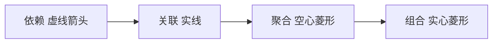

# 01 · 类之间的关系（核心）

### 1. 本节核心问题

- **类图里六种关系分别是什么？**
- **每种关系用什么线条、箭头、菱形表示？**
- **关联和聚合有什么区别？怎么选？**

---

## 2. 一句话总览

UML 类图用 **线型 + 箭头/菱形** 表达两个类之间的语义强度：

```text
依赖 ──> 关联 ──> 聚合 ──> 组合     （引用强度递增）
继承 / 实现                          （类型层次，单独一类）
```

---

## 3. 六种关系详解

### 3.1 依赖 Dependency（最弱）

**含义**：A **临时**用到 B，通常不是长期成员持有。

典型场景：
- 方法参数、局部变量
- 静态方法调用
- 一次性的 `Activate()` 调用

**画法**：

```text
A - - - - - - - - > B
    虚线 + 空心箭头（指向被依赖方）
```

**示例**：

```text
OwnerActor - - - - -> UGameplayAbility
           Activate
```

玩家激活技能时「用到」Ability，但不是长期拥有 Ability 对象本身。

**代码对应**：

```cpp
void TryActivateAbility(FGameplayAbilitySpecHandle Handle);  // 参数是 Handle，临时调用
```

---

### 3.2 关联 Association

**含义**：A **知道** B，存在较稳定的引用，但 **不是**「整体–部分」关系。

典型场景：
- 成员指针/引用，但语义上是「使用对象」而非「由…组成」
- 双向关系（教师 ↔ 学生上的课）

**画法**：

```text
A ──────────────> B    实线 + 空心箭头（有方向）
A ────────────── B     实线无箭头（双向或无方向）
```

**示例**：

```text
AAuraCharacter ──────────> UAbilitySystemComponent
```

角色「有一个」ASC，这是持有关系。若强调生命周期绑定，有人会画成组合（见 3.4）。

**与依赖的区别**：

| | 依赖 | 关联 |
|---|------|------|
| 线 | 虚线 | 实线 |
| 持续时间 | 短（一次调用） | 长（成员字段级） |
| 例子 | 函数参数 | `TObjectPtr<UASC> AbilitySystemComponent` |

---

### 3.3 聚合 Aggregation（弱整体–部分）

**含义**：A 是 **整体**，B 是 **部分**，但 B **可以独立存在**；整体销毁后，部分不一定销毁。

**画法**：

```text
整体 ◇────────── 部分
     空心菱形在「整体」一侧
```

**示例 1：学校与学生**

```text
学校 ◇──────── 学生
```

- 学校「包含」在读学生
- 学校关闭，学生还在（转学、毕业）

**示例 2：GAS**

```text
FGameplayAbilitySpec ◇──────── UGameplayAbility*
```

- Spec 引用 Ability（CDO/资产）
- Spec 被移除，FireBolt 资产仍在
- 多个 Spec 可指向同一个 Ability

**代码对应**：

```cpp
struct FGameplayAbilitySpec
{
    UGameplayAbility* Ability;  // 指针，不拥有生命周期
    int32 Level;
    // ...
};
```

---

### 3.4 组合 Composition（强整体–部分）

**含义**：A **强拥有** B，**同生共死**；整体销毁，部分必须销毁。

**画法**：

```text
整体 ◆────────── 部分
     实心菱形在「整体」一侧
```

**示例 1：订单与订单项**

```text
订单 ◆──────── 订单项
```

删订单，订单项也没了。

**示例 2：GAS**

```text
UAbilitySystemComponent ◆──────── FGameplayAbilitySpecContainer
FGameplayAbilitySpecContainer ◆──────── FGameplayAbilitySpec[]
```

- ASC 销毁，ActivatableAbilities 里的 Spec 全部消失
- Container 是 Spec 数组的「拥有者」

**代码对应**：

```cpp
class UAbilitySystemComponent
{
    FGameplayAbilitySpecContainer ActivatableAbilities;  // 值类型容器，拥有 Spec
};
```

---

### 3.5 继承 Generalization（泛化）

**含义**：子类 **is-a** 父类。

**画法**：

```text
子类 ───────────▷ 父类
     实线 + 空心三角（三角指向父类）
```

**示例**：

```text
UAuraGameplayAbility ─────▷ UGameplayAbility
UAuraAbilitySystemComponent ─────▷ UAbilitySystemComponent
AAuraCharacter ─────▷ ACharacter ─────▷ APawn
```

**注意**：三角 **永远指向父类**，不是子类。

---

### 3.6 实现 Realization（接口实现）

**含义**：类 **implements** 接口（纯虚/抽象契约）。

**画法**：

```text
类 - - - - - - - - ▷ 接口
     虚线 + 空心三角（三角指向接口）
```

**与继承的区别**：

| | 继承 | 实现 |
|---|------|------|
| 线 | **实线** | **虚线** |
| 指向 | 父类 | 接口 |
| 语义 | is-a | 履行契约 |

**UE 示例**：

```text
UAuraAttributeSet - - - - - ▷ IGameplayTagAssetInterface
```

（若项目里 AttributeSet 实现了某 Tag 接口，可用此画法。）

---

## 4. 关联 vs 聚合 vs 组合（重点对比）

三者都可能是「A 里有 B」，差别在 **语义** 和 **生命周期**：

| 关系 | 符号 | 整体–部分？ | 部分能独立？ | 典型例子 |
|------|------|-------------|--------------|----------|
| **关联** | 实线（可选箭头） | 否 | — | 玩家 → 当前目标 |
| **聚合** | ◇ 空心菱形 | 是 | **能** | Spec ◇── Ability CDO |
| **组合** | ◆ 实心菱形 | 是 | **不能** | ASC ◆── Spec 数组 |

**两问决策法**：

1. 是不是「整体包含部分」？  
   - 否 → **关联**（或依赖）  
   - 是 → 第 2 问  

2. 整体没了，部分还要存在吗？  
   - 要 → **聚合 ◇**  
   - 不要 → **组合 ◆**

---

## 5. 强度排序（从弱到强）

```text
依赖 < 关联 < 聚合 < 组合
```



继承/实现不参与这条链，它们描述的是 **类型层次**，不是拥有强度。

---

## 6. 完整对照表

| 关系 | 英文 | 线型 | 箭头/符号 | 方向 | 常见标注 |
|------|------|------|-----------|------|----------|
| 依赖 | Dependency | 虚线 `-->` | 空心箭头 `>` | 指向被依赖者 | `<<use>>`、`Activate` |
| 关联 | Association | 实线 `—` | 可选空心箭头 | 视情况 | 角色名、多重性 |
| 聚合 | Aggregation | 实线 | 空心菱形 `◇` | 菱形在整体侧 | 多重性 |
| 组合 | Composition | 实线 | 实心菱形 `◆` | 菱形在整体侧 | 多重性 |
| 继承 | Generalization | 实线 | 空心三角 `▷` | 三角指向父类 | — |
| 实现 | Realization | 虚线 | 空心三角 `▷` | 三角指向接口 | `<<interface>>` |

---

## 7. draw.io 里怎么选

左侧面板 → **UML**：

| 形状名 | 对应关系 |
|--------|----------|
| Dependency | 依赖 |
| Association | 关联 |
| Aggregation | 聚合（空心菱形） |
| Composition | 组合（实心菱形） |
| Generalization | 继承 |
| Realization | 实现 |

拖两个 **Class** 框，再用上述连线连接。

---

## 8. 常见坑点

| 坑 | 原因 | 现象 |
|----|------|------|
| 继承三角画反 | 应指向父类 | 读图时 is-a 关系颠倒 |
| 所有指针都画聚合 | 教程图不严格 | 其实「普通引用」用关联即可 |
| 混淆依赖与关联 | 没区分临时/长期 | 虚线实线混用 |
| Instant GE 想挂 Tag | 生命周期 | 与 UML 无关，但 GAS 里 Instant 效果 Tag 挂不住 |

---

## 9. 五句速记

1. **虚线箭头** = 依赖；**虚线三角** = 实现接口  
2. **实线三角** = 继承，三角指父类  
3. **实线无菱形** = 关联；有菱形 = 整体–部分  
4. **空心菱形 ◇** = 弱拥有；**实心菱形 ◆** = 强拥有  
5. 两问法：是否整体–部分？部分能否独立？

---

## 10. 复习检查

- [ ] 能画出六种关系的线型吗？  
- [ ] 能解释 Spec ◇── Ability 为什么是聚合吗？  
- [ ] 能解释 ASC ◆── SpecContainer 为什么是组合吗？  
- [ ] 依赖和关联的区别能说清楚吗？  
- [ ] 继承和实现的线型差异是什么？
