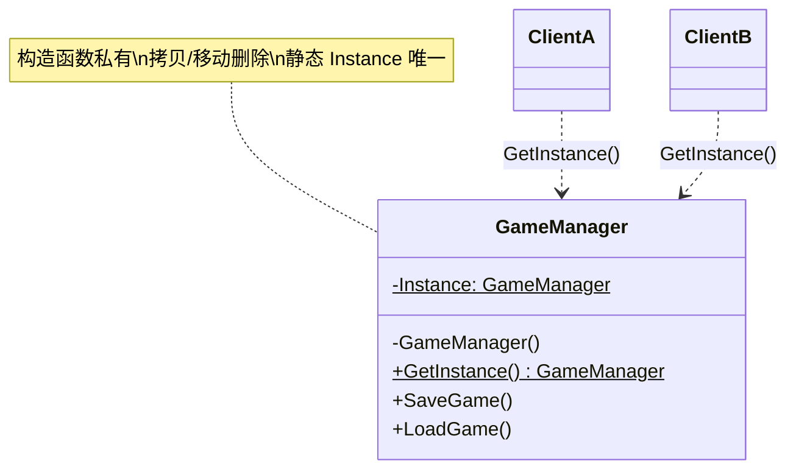

# 单例

## Singleton

# 单例模式（Singleton）深度透析

单例模式解决的核心问题是：**保证一个类在整个程序（或明确作用域）中只有一个实例**，并提供全局统一的访问点。

------

## 1. 意图与本质

GoF 定义：保证一个类仅有一个实例，并提供一个访问它的全局访问点。

用一句话说：

> **私有构造 + 静态访问 + 全局唯一**

### 核心作用（简要）

1. **唯一实例**：配置表、资源管理器、日志中心只应有一份
2. **全局访问**：任意处 `GetInstance()` 拿到同一对象
3. **延迟初始化**：第一次使用时才创建（Lazy Initialization）

------

## 2. 结构拆解

单例结构比工厂类简单，通常**只有一个类**，重点是约束实例数量。

### UML 类图（标准关系）



### 关系说明

| 元素 | 含义 |
| :--- | :--- |
| `$` | UML 中表示 **static** 成员 |
| 私有构造函数 | 外部无法 `new GameManager()` |
| `GetInstance()` | 全局访问点 |
| 删除拷贝/赋值 | 防止复制出第二个实例 |

| 角色 | 职责 |
| :--- | :--- |
| Singleton | 自身管理唯一实例 |
| Client | 通过 `GetInstance()` 访问，不应直接构造 |

------

## 3. 关键机制：C++ 实现方式

### 3.1 Meyers Singleton（推荐，C++11 起线程安全）

```cpp
class FGameManager {
public:
    static FGameManager& Get() {
        static FGameManager Instance;  // 局部静态，首次调用时构造
        return Instance;
    }

    void SaveGame() { /* ... */ }

    FGameManager(const FGameManager&) = delete;
    FGameManager& operator=(const FGameManager&) = delete;

private:
    FGameManager() = default;
    ~FGameManager() = default;
};

// 使用
FGameManager::Get().SaveGame();
```

**优点**：代码少；C++11 保证局部静态初始化线程安全；程序结束自动析构。

### 3.2 堆分配 + 永不销毁（少见）

```cpp
static FGameManager& Get() {
    static FGameManager* Instance = new FGameManager();
    return *Instance;
}
```

故意不 delete，避免静态析构顺序问题 —— 现代 C++ 更推荐 Meyers + 明确生命周期。

### 3.3 饿汉式 vs 懒汉式

| 方式 | 行为 | 特点 |
| :--- | :--- | :--- |
| **懒汉式** | 第一次 `Get()` 才创建 | 省资源，Meyers 默认如此 |
| **饿汉式** | 程序启动即创建 | 实现简单，可能浪费 |

### 3.4 单态（Monostate，变体）

行为像单例，但**允许 new 多个对象**，数据却共享（静态成员）：

```cpp
class FPrinter {
    static int Id;
public:
    int GetId() const { return Id; }
    void SetId(int Value) { Id = Value; }
};
```

外观像普通类，实则共享状态 —— 易误导，慎用。

------

## 4. C++ 示例骨架（游戏向）

```cpp
class FAudioManager {
public:
    static FAudioManager& Get() {
        static FAudioManager Instance;
        return Instance;
    }

    void PlaySound(const FString& Name) { /* ... */ }
    void SetMasterVolume(float Volume) { MasterVolume = Volume; }

    FAudioManager(const FAudioManager&) = delete;
    FAudioManager& operator=(const FAudioManager&) = delete;

private:
    FAudioManager() = default;
    float MasterVolume = 1.0f;
};
```

### UE 中的「单例思想」（不一定是 GoF 单例类）

| 机制 | 说明 |
| :--- | :--- |
| `GEngine` | 引擎全局入口 |
| `UGameInstance` | 一局游戏一个，Subsystems 挂载其上 |
| `UWorld` Subsystems | 按 World 唯一 |
| `GetGameInstance()->GetSubsystem<UXxx>()` | UE 推荐的「有作用域的单例」 |

UE 更推荐 **GameInstance Subsystem / World Subsystem**，而不是手写全局单例 God Class。

------

## 5. 游戏开发中的典型应用场景

### ① 音频 / 输入 / 时间管理

全局唯一，`AudioManager::Get().Play(...)`。

### ② 对象池入口

池管理器全局一份，统一 Allocate/Release。

### ③ 配置与表格缓存

只读 DataTable 加载一次，多处查询。

### ④ 日志 / 性能统计

全局收集点。

### 更适合用「作用域单例」而非全局单例

- 关卡内唯一 → `UWorldSubsystem`
- 整局游戏唯一 → `UGameInstanceSubsystem`
- 玩家唯一 → 挂在 `APlayerController` / `APlayerState`

------

## 6. 与相关模式的边界

| 对比 | 单例 | 区别 |
| :--- | :--- | :--- |
| **工厂** | 管创建多个产品 | 单例管**只有一个自己** |
| **原型** | 克隆多个副本 | 单例**禁止**多实例 |
| **依赖注入 DI** | 容器管理唯一实例 | 单例是类自己管理自己 |
| **静态全局变量** | 类似但无封装 | 单例有访问控制与延迟初始化 |

### 单例 vs 依赖注入（重要）

```cpp
// ❌ 硬依赖单例 —— 难测试
int Total = SingletonDatabase::Get().Query(...);

// ✅ 依赖抽象，构造注入 —— 可 Mock
FRecordFinder(FDatabase& Db) : Db(Db) {}
```

**工程共识**：若必须用「唯一实例」，优先 **DI 容器注册 Singleton**，而不是到处 `Xxx::GetInstance()`。

------

## 7. 优点与代价

### 优点

1. 控制实例数量，节省资源
2. 全局访问方便
3. 可延迟初始化

### 代价（为什么单例「名声不好」）

1. **隐藏依赖**：看函数签名不知道用了单例
2. **难单元测试**：无法轻易替换 Mock
3. **全局状态**：增加耦合，多线程要加锁
4. **析构顺序**：静态单例互相引用可能崩溃
5. **违反单一职责**：类既管业务又管自己的生命周期

------

## 8. 在 Unreal Engine 中的对应思想

| 需求 | 更 UE 的做法 |
| :--- | :--- |
| 全局引擎服务 | `GEngine`、`GWorld`（引擎管理，勿模仿为业务单例） |
| 游戏级唯一 | `UGameInstance` + Subsystem |
| 关卡级唯一 | `UWorldSubsystem` |
| 模块化服务 | `UModuleInterface`、插件单例 |
| 避免 God Class | 拆 Subsystem，接口 + 注入 |

Aura 里 `OverlayWidgetController` 由 HUD 创建并持有，是**所有者管理生命周期**，比全局单例更清晰。

------

## 9. 设计时该怎么用（实战 checklist）

1. 是否真的**只能有一个**实例？（多实例会出 Bug 吗？）
2. 是否必须**全局**访问？（能否挂在 GameInstance / Player 上？）
3. 是否需要**可测试**？（是 → 避免硬编码 GetInstance）
4. 是否有多线程竞争？（C++11 Meyers 初始化安全，成员访问仍可能要锁）
5. 能否用 **Subsystem / DI** 替代？（UE 项目优先）

**经验法则**：先问「能不能不用单例」；实在不行再用，且集中在一处访问。

------

## 10. 常见反模式

| 反模式 | 问题 | 更好做法 |
| :--- | :--- | :--- |
| 到处 `Xxx::Get()` | 隐藏依赖、难测 | 构造/函数参数注入 |
| 单例里塞满所有逻辑 | God Class | 拆 Subsystem / Service |
| 单例互相引用析构 | 静态析构顺序崩溃 | Meyers + 避免循环依赖 |
| 可继承单例基类 | 子类也单例，语义混乱 | 组合优于继承 |
| 把单例当全局变量桶 | 任意写状态 | 明确职责与作用域 |

------

## 11. 小结

单例不是「方便全局用的变量」，而是：

1. **严格控制**实例数量为 1
2. 提供**受控**的全局访问点
3. 在现代 C++ / UE 里，优先考虑 **Subsystem 或 DI**，而非手写 God Singleton

一句话：**当「全局只要一份」且作用域明确时，才考虑单例；能注入就不要 GetInstance。**

------

# 单例模式的作用（简要）

> 保证类只有一个实例，并提供统一访问入口。

- **唯一性**：配置、管理器、缓存只存在一份
- **访问点**：`Get()` / `GetInstance()` 随处可用
- **现代实践**：C++ 用 Meyers Singleton；UE 用 Subsystem；测试用依赖注入替代硬编码单例

### 快速实现模板（C++11+）

```cpp
class FMyManager {
public:
    static FMyManager& Get() {
        static FMyManager Inst;
        return Inst;
    }
    FMyManager(const FMyManager&) = delete;
    FMyManager& operator=(const FMyManager&) = delete;
private:
    FMyManager() = default;
};
```
