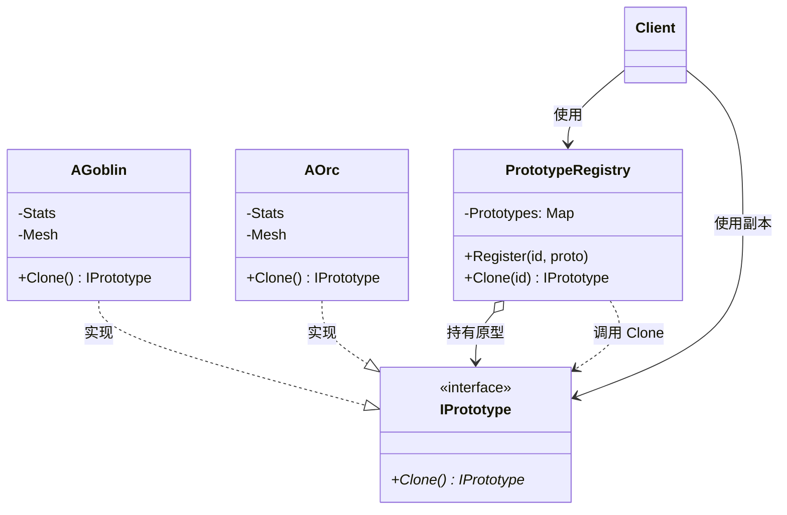

# 原型

## Prototype

# 原型模式（Prototype）深度透析

原型模式解决的核心问题是：**当构造一个对象成本很高，或已有配置好的实例时，通过复制（克隆）来创建新对象**，而不是每次都从头构造。

------

## 1. 意图与本质

GoF 定义：用原型实例指定创建对象的种类，并且通过拷贝这些原型创建新的对象。

用一句话说：

> **以已有对象为模板，克隆出独立副本，再按需微调**

### 核心作用（简要）

1. **避免重复初始化**：从配置好的原型复制，比重新加载/组装快
2. **运行时动态类型**：克隆时不必知道具体类名，只需 `Clone()`
3. **独立副本**：克隆体与原对象分离，改副本不影响原型

------

## 2. 结构拆解

### UML 类图（标准关系）



### 关系说明（UML 规范）

| 关系 | 画法 | 本例 |
| :--- | :--- | :--- |
| **实现** | 虚线空心三角指向接口 | `AGoblin ──▷ IPrototype` |
| **关联** | 实线 | `PrototypeRegistry` 持有多个原型 |
| **依赖** | 虚线箭头 | Registry 调用 `Clone()` 产生新对象 |

| 角色 | 职责 |
| :--- | :--- |
| Prototype（原型接口） | 声明 `Clone()` |
| ConcretePrototype（具体原型） | 实现深拷贝/浅拷贝逻辑 |
| Client | 通过原型克隆，而非直接 new |
| PrototypeRegistry（可选） | 按 ID 管理原型库，统一克隆入口 |

------

## 3. 关键机制：深拷贝 vs 浅拷贝

这是原型模式在 C++ 里的**核心难点**。

### 浅拷贝（危险）

```cpp
struct FContact {
    FString Name;
    FAddress* Address = nullptr;  // 指针成员
};

FContact B = A;  // 默认拷贝：B.Address 与 A.Address 指向同一块内存
```

修改 `B.Address` 会连带改掉 `A` —— 游戏对象里若有组件指针、共享资源，浅拷贝常出 Bug。

### 深拷贝（正确做法）

```cpp
class AGoblin : public IEnemy {
public:
    AGoblin* Clone() const override {
        return new AGoblin(*this);  // 依赖正确的拷贝构造
    }

    AGoblin(const AGoblin& Other)
        : Stats(Other.Stats)
        , Mesh(Other.Mesh)  // UE 里注意 DuplicateObject / 组件复制策略
    {}
};
```

### 三种常见实现方式

| 方式 | 说明 | 适用 |
| :--- | :--- | :--- |
| **拷贝构造 / 赋值** | 手写深拷贝逻辑 | 结构清晰，C++ 最常见 |
| **virtual Clone()** | 多态克隆，返回基类指针 | 运行时不知道具体类型 |
| **序列化/反序列化** | 写入内存再读回 | 已有存档管线时可复用 |

------

## 4. C++ 示例骨架

```cpp
class IPrototype {
public:
    virtual ~IPrototype() = default;
    virtual std::unique_ptr<IPrototype> Clone() const = 0;
};

class AGoblin : public IPrototype {
public:
    int HP = 100;
    FString Name = "Goblin";

    std::unique_ptr<IPrototype> Clone() const override {
        return std::make_unique<AGoblin>(*this);
    }
};

class AOrc : public IPrototype {
public:
    int HP = 200;
    FString Name = "Orc";

    std::unique_ptr<IPrototype> Clone() const override {
        return std::make_unique<AOrc>(*this);
    }
};

// 原型注册表（可选）
class FEnemyPrototypeRegistry {
    TMap<FName, TUniquePtr<IPrototype>> Prototypes;

public:
    void Register(FName Id, TUniquePtr<IPrototype> Proto) {
        Prototypes.Add(Id, std::move(Proto));
    }

    std::unique_ptr<IPrototype> Clone(FName Id) const {
        if (const TUniquePtr<IPrototype>* Found = Prototypes.Find(Id)) {
            return (*Found)->Clone();
        }
        return nullptr;
    }
};

// 使用
FEnemyPrototypeRegistry Registry;
Registry.Register("Goblin", std::make_unique<AGoblin>());

auto Enemy1 = Registry.Clone("Goblin");
auto Enemy2 = Registry.Clone("Goblin");  // 两只独立 Goblin
```

### 原型工厂（Prototype + Factory 思想）

```cpp
class FEmployeeFactory {
    static FContact MainOffice;  // 预配置原型

public:
    static FContact NewEmployee(const FString& Name, int Suite) {
        FContact Result = MainOffice;  // 克隆
        Result.Name = Name;
        Result.Address.Suite = Suite;  // 微调
        return Result;
    }
};
```

把构造函数设为 private，只允许通过工厂从原型克隆 —— 避免「半成品对象」流到客户端。

------

## 5. 游戏开发中的典型应用场景

### ① 敌人 / NPC 批量生成

Designer 在编辑器里配好一只「标准 Goblin」，运行时 `DuplicateObject` 或 `Clone()` 生成多只，再改位置/等级。

### ② UE DuplicateObject

```cpp
AActor* Copy = DuplicateObject<AActor>(SourceActor, Outer);
```

UE 内置的对象复制，本质就是原型思想（注意 Outer 与组件深拷贝规则）。

### ③ 子弹 / 弹丸 / 特效

从模板 Actor 或 DataAsset 克隆实例，比每次从 JSON 重建快。

### ④ 存档与回放

保存快照 = 序列化原型状态；读档 = 反序列化克隆。

### ⑤ 技能 / Buff 实例

`UGameplayEffect` Spec 从模板复制后修改 SetByCaller 参数。

------

## 6. 与相关模式的边界

| 对比 | 原型 | 区别 |
| :--- | :--- | :--- |
| **工厂方法** | 每次 new 新实例 | 原型从**已有对象复制** |
| **抽象工厂** | 创建一族新产品 | 原型关注**复制**，不是配套 |
| **建造者** | 分步组装 | 原型假设**已有完整模板** |
| **Flyweight** | 共享内部状态 | 原型要**独立副本**，目标相反 |

**记忆口诀**：
- 工厂：**new 一个新的**
- 原型：**Copy 一个现成的**

------

## 7. 优点与代价

### 优点

1. 隐藏具体类名，客户端只调 `Clone()`
2. 复制比重新加载资源/重建对象图更快
3. 可在运行时保存「模板对象」，动态生成变体

### 代价

1. **深拷贝难写**：指针、组件、循环引用、共享资源
2. 克隆带有多态指针时需 virtual Clone()，每个子类都要实现
3. 序列化克隆有额外 CPU/内存开销

------

## 8. 在 Unreal Engine 中的对应思想

| 场景 | API / 机制 |
| :--- | :--- |
| 对象复制 | `DuplicateObject<T>()` |
| 实例化模板 | `SpawnActor` + 预制配置好的 Class Defaults |
| 组件复制 | `EditInlineNew`、`CreateCopy` |
| 结构体拷贝 | 值类型 `F` 结构体默认逐成员拷贝 |
| UObject 克隆 | 注意 Outer、Transient、GC 与组件 Attaching |

**UE 注意**：`AActor` / `UObject` 不能简单默认拷贝，通常用 `DuplicateObject` 或 Spawn 同一 Class 再改属性，而不是手写拷贝构造。

------

## 9. 设计时该怎么用（实战 checklist）

1. 创建对象是否**比修改副本更贵**？（加载模型、解析配置）
2. 是否已有**配置好的模板**？（标准敌人、标准 UI 页）
3. 副本是否需要**独立于原型**？（是 → 必须深拷贝）
4. 类型是否在**运行时才能确定**？（是 → virtual Clone()）
5. 对象图是否极复杂？（考虑 DuplicateObject / 序列化）

------

## 10. 常见反模式

| 反模式 | 问题 | 更好做法 |
| :--- | :--- | :--- |
| 默认拷贝含指针成员 | 共享状态、难调试 Bug | 深拷贝或 value 语义 |
| 克隆后忘记改关键字段 | 多个实例 ID/位置相同 | Clone 后强制 InitFromTemplate |
| UObject 手写 memcpy 式拷贝 | 违反 GC/Outer 规则 | 用 DuplicateObject / Spawn |
| 原型与实例共用可变资源 | 改一个全变 | 共享只读资源，可变数据复制 |

------

## 11. 小结

原型模式不是「抄代码」，而是：

1. 定义**克隆接口**（`Clone()` 或拷贝构造）
2. 保证副本**独立**（深拷贝）
3. 从模板**微调**得到新对象

一句话：**当「复制已有对象」比「从头创建」更简单或更快时，用原型。**

------

# 原型模式的作用（简要）

> 通过克隆已有实例来创建新对象，避免重复构造，并可在运行时动态复制。

- **性能**：从配好的模板复制，省去重复加载
- **灵活**：客户端只调 `Clone()`，不必知道具体类
- **关键**：C++ / UE 里务必处理好**深拷贝**，浅拷贝是原型模式最常见的坑
