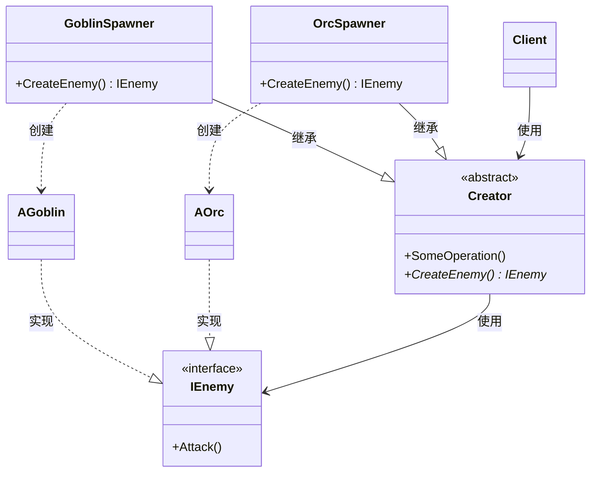

# 工厂方法

## Factory Method

# 工厂方法（Factory Method）深度透析

工厂方法解决的核心问题是：**把「创建哪种具体对象」的决定延迟到子类**，让父类只依赖抽象产品，而不写死 `new ConcreteX()`。

------

## 1. 意图与本质

GoF 定义：定义一个用于创建对象的接口，让子类决定实例化哪一个类。工厂方法使一个类的实例化延迟到其子类。

用一句话说：

> **父类定义创建流程，子类决定创建谁**

### 核心作用（简要）

1. **解耦创建与使用**：调用方依赖抽象，不依赖具体类名
2. **开闭原则**：新增一种产品 = 新增子类，不必改原有代码
3. **单一产品等级**：一个工厂方法只负责创建**一种**产品类型（如 Enemy）

------

## 2. 结构拆解

GoF 工厂方法有**两条类层次**：创建者（Creator）+ 产品（Product）。

### UML 类图（标准关系）



### 关系说明（UML 规范）

| 关系 | 画法 | 箭头方向 | 本例 |
| :--- | :--- | :--- | :--- |
| **继承**（Generalization） | 实线 + 空心三角 | 三角指向**父类** | `GoblinSpawner ──▷ Creator` |
| **实现**（Realization） | 虚线 + 空心三角 | 三角指向**接口** | `AGoblin ──▷ IEnemy` |
| **依赖**（Dependency） | 虚线 + 普通箭头 | 指向被创建/使用者 | `GoblinSpawner ──► AGoblin` |

> **常见错误**：把 `CreateEnemy()` 画成 Creator 继承 IEnemy；Creator 与 Product 是**使用/创建**关系，不是继承。

### 文字版结构

```
  Client ──使用──► Creator（调用 SomeOperation，内部会 CreateEnemy）

  GoblinSpawner ──▷ Creator          （继承，子类重写工厂方法）
  OrcSpawner    ──▷ Creator

  GoblinSpawner ──► AGoblin ──▷ IEnemy
  OrcSpawner    ──► AOrc    ──▷ IEnemy
       （依赖：创建）  （实现）
```

| 角色 | 职责 |
| :--- | :--- |
| Product（抽象产品） | 定义产品接口，如 `IEnemy` |
| ConcreteProduct（具体产品） | 工厂方法创建的具体类 |
| Creator（创建者） | 声明工厂方法，可能包含使用该产品的模板流程 |
| ConcreteCreator（具体创建者） | 重写工厂方法，返回具体产品 |
| Client | 依赖 Creator 抽象，不直接 new 具体产品 |

------

## 3. 关键机制：延迟到子类

```cpp
// 父类：定义流程 + 抽象工厂方法
class AEnemySpawner {
public:
    void SpawnWave() {
        for (int i = 0; i < 5; ++i) {
            IEnemy* Enemy = CreateEnemy();  // 多态：子类决定类型
            Enemy->Attack();
        }
    }
    virtual ~AEnemySpawner() = default;
protected:
    virtual IEnemy* CreateEnemy() = 0;  // 工厂方法
};

// 子类：决定创建 Goblin
class AGoblinSpawner : public AEnemySpawner {
protected:
    IEnemy* CreateEnemy() override {
        return new AGoblin();
    }
};
```

**要点**：`SpawnWave()` 是固定流程，`CreateEnemy()` 是变化点——这就是**模板方法 + 工厂方法**的常见组合。

------

## 4. C++ 示例骨架

```cpp
class IEnemy {
public:
    virtual ~IEnemy() = default;
    virtual void Attack() = 0;
};

class AGoblin : public IEnemy {
public:
    void Attack() override { /* Goblin 攻击 */ }
};

class AOrc : public IEnemy {
public:
    void Attack() override { /* Orc 攻击 */ }
};

class AEnemySpawner {
public:
    virtual ~AEnemySpawner() = default;
    void SpawnWave() {
        for (int i = 0; i < 5; ++i) {
            std::unique_ptr<IEnemy> Enemy(CreateEnemy());
            Enemy->Attack();
        }
    }
protected:
    virtual IEnemy* CreateEnemy() = 0;
};

class AGoblinSpawner : public AEnemySpawner {
protected:
    IEnemy* CreateEnemy() override { return new AGoblin(); }
};

class AOrcSpawner : public AEnemySpawner {
protected:
    IEnemy* CreateEnemy() override { return new AOrc(); }
};

// 客户端
void RunSpawner(AEnemySpawner& Spawner) {
    Spawner.SpawnWave();  // 不关心具体 Enemy 类型
}
```

### 静态工厂方法（变体）

不一定用虚函数，也可以是**静态**工厂方法：

```cpp
class ShapeFactory {
public:
    static IShape* Create(const FString& Type) {
        if (Type == "Circle")  return new Circle();
        if (Type == "Square")  return new Square();
        return nullptr;
    }
};
```

这更接近「简单工厂」，扩展新类型仍需改 `if-else`，不如虚函数工厂方法符合开闭原则。

------

## 5. 游戏开发中的典型应用场景

### ① 敌人生成器

`GoblinSpawner` / `OrcSpawner` / `BossSpawner` 各自 `CreateEnemy()`，关卡设计只换 Spawner 类型。

### ② UE Spawn 体系

`AActor::SpawnActor<T>()` + 子类重写初始化逻辑；Blueprint 里 `Construct Object from Class` 也是工厂思想。

### ③ 技能 / Ability 创建

不同职业 Subclass 重写 `CreateDefaultAbility()`，产出各自技能实例。

### ④ 存档加载

根据类型 ID 调用对应 Factory 创建运行时对象（常与原型、注册表结合）。

------

## 6. 与相关模式的边界

| 对比 | 工厂方法 | 区别 |
| :--- | :--- | :--- |
| **简单工厂** | 一个函数 + if-else 集中创建 | 工厂方法把创建**分散到子类**，更易扩展 |
| **抽象工厂** | 创建**一族**多个产品 | 工厂方法只创建**一种**产品等级 |
| **建造者** | 分步构建一个复杂对象 | 工厂方法通常**一步** new 出产品 |
| **原型** | 克隆已有对象 | 工厂方法**新建**实例 |

### 三种工厂对比

```
简单工厂：  ShapeFactory::Create("Circle")     → 一个入口，改 if-else
工厂方法：  CircleFactory::CreateShape()       → 一个产品，子类决定
抽象工厂：  UIFactory::CreateButton()+CreatePanel() → 一族产品
```

**记忆口诀**：
- 简单工厂：**一个函数包打天下**
- 工厂方法：**一个方法，子类决定类型**
- 抽象工厂：**一组方法，产出一族**

------

## 7. 优点与代价

### 优点

1. 符合开闭原则，新增产品类型加子类即可
2. 创建逻辑与业务逻辑分离
3. Creator 可定义使用产品的模板流程（`SomeOperation`）

### 代价

1. 每多一种产品，至少多一个 ConcreteCreator（类数量增加）
2. 只解决**一个产品等级**的创建，多产品要用抽象工厂
3. 简单场景用工厂方法可能过度设计

------

## 8. 在 Unreal Engine 中的对应思想

| 场景 | 近似实现 |
| :--- | :--- |
| Spawn | `GetWorld()->SpawnActor<AEnemy>(Class, ...)` |
| 组件创建 | `CreateDefaultSubobject<UXXX>(TEXT("Name"))` 在子类构造函数中 |
| Blueprint | `Spawn Actor from Class`、子类重写 Event |
| GAS | `GiveAbility(TSubclassOf<UGameplayAbility>)` |
| NewObject | `NewObject<UMyWidget>(Outer, WidgetClass)` |

UE 里 **`TSubclassOf<T>` + Spawn/NewObject** 就是非常典型的工厂方法用法：类型在运行时/配置中决定，而不是写死在 C++ 里。

------

## 9. 设计时该怎么用（实战 checklist）

1. 是否只有**一种产品**需要按条件/子类创建？（是 → 工厂方法）
2. 创建类型是否会**频繁扩展**？（是 → 避免简单工厂 if-else）
3. 创建前后是否有**固定流程**？（是 → Creator 模板方法 + 工厂方法）
4. 是否需要**同时创建多种配套产品**？（是 → 用抽象工厂，不是工厂方法）
5. 是否只是 2～3 处 `new`？（可能不必抽象）

------

## 10. 常见反模式

| 反模式 | 问题 | 更好做法 |
| :--- | :--- | :--- |
| 巨型 if-else 简单工厂 | 每加类型改一处 | 改为子类重写工厂方法或注册表 |
| Creator 与 Product 混为一谈 | 职责混乱 | 创建者管创建，产品管行为 |
| 客户端仍直接 new 具体类 | 工厂形同虚设 | 强制通过 Creator/Spawner |
| 所有创建都用工厂方法 | 过度设计 | 简单对象直接构造 |

------

## 11. 小结

工厂方法不是「写一个 static Create()」，而是：

1. 在**父类**中定义创建接口（工厂方法）
2. 由**子类**决定实例化哪个具体产品
3. 客户端只依赖**抽象 Creator 和 Product**

一句话：**当「创建哪种对象」会变化，且只有一种产品等级时，用工厂方法。**

------

# 工厂方法的作用（简要）

> 把对象的创建延迟到子类，调用方只依赖抽象，不写死具体类型。

- **解耦**：业务代码不 `new Goblin()`，而是 `Spawner->CreateEnemy()`
- **扩展**：加新敌人 = 加新 Spawner，不改旧代码
- **对比抽象工厂**：工厂方法管**一种**产品；抽象工厂管**一族**产品
