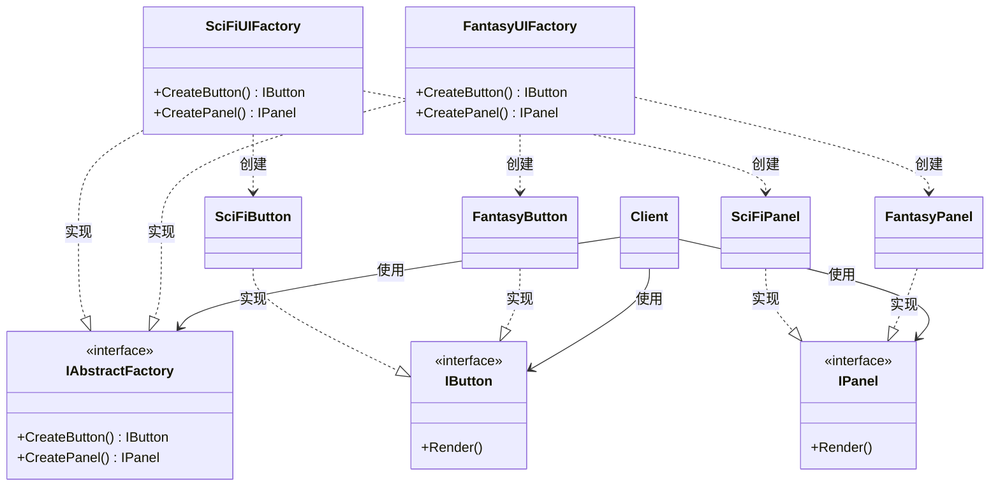

# 抽象工厂

## Abstract Factory

# 抽象工厂（Abstract Factory）深度透析

抽象工厂解决的核心问题是：**如何创建一组相互关联、风格一致的对象**，并保证客户端不会混用不兼容的产品族。

------

## 1. 意图与本质

GoF 定义：提供一个接口，用于创建相关或依赖对象的家族，而不需要指定具体类。

用一句话说：

> **产品族 + 统一工厂接口 + 保证配套一致**

### 核心作用（简要）

1. **创建一整套对象**：不是单个产品，而是一族相关产品（按钮 + 面板 + 字体）。
2. **保证风格/平台一致**：科幻 UI 不会混入奇幻 UI 的资源。
3. **切换产品族只需换工厂**：客户端代码几乎不用改。

------

## 2. 结构拆解

GoF 抽象工厂有**两条类层次**：工厂层次 + 产品层次。之前简图把「实现」画成自上而下、且缺少抽象产品，不符合 UML。

### UML 类图（标准关系）



### 关系说明（UML 规范）

| 关系 | 画法 | 箭头方向 | 本例 |
| :--- | :--- | :--- | :--- |
| **实现**（Realization） | 虚线 + 空心三角 | 三角指向**接口** | `SciFiUIFactory ──▷ IAbstractFactory` |
| **依赖**（Dependency） | 虚线 + 普通箭头 | 箭头指向**被依赖者** | `SciFiUIFactory ──► SciFiButton`（工厂创建产品） |
| **关联**（Association） | 实线 + 普通箭头 | 箭头指向**被使用者** | `Client ──► IAbstractFactory`（客户端持有工厂） |

> **常见错误**：把实现关系画成「接口指向子类 ▼」，或把 `CreateButton()` 当成继承线——实现箭头应**指向抽象**，创建是**依赖**而非继承。

| 角色 | 职责 |
| :--- | :--- |
| AbstractFactory（抽象工厂） | 声明创建一族产品的接口 |
| ConcreteFactory（具体工厂） | 实现接口，产出同一风格/平台的具体产品 |
| AbstractProduct（抽象产品） | 一类产品的共同接口（如 IButton） |
| ConcreteProduct（具体产品） | 具体工厂创建的实际对象 |
| Client（客户端） | 只依赖抽象工厂和抽象产品 |

------

## 3. 关键机制：产品族

**产品族（Product Family）**：由同一个工厂生产的、彼此配套的一组对象。

**产品等级（Product Hierarchy）**：同一类产品的继承体系（如所有 Button 的基类）。

```
产品族 A（SciFi）          产品族 B（Fantasy）
├── SciFiButton            ├── FantasyButton
├── SciFiPanel             ├── FantasyPanel
└── SciFiFont              └── FantasyFont
```

客户端通过 `IUIFactory` 创建 UI，永远得到同一套风格；切换风格 = 换一个 Factory 实例。

------

## 4. C++ 示例骨架

```cpp
// ── 抽象产品 ──
class IButton {
public:
    virtual ~IButton() = default;
    virtual void Render() = 0;
};

class IPanel {
public:
    virtual ~IPanel() = default;
    virtual void Render() = 0;
};

// ── 产品族 A：科幻 ──
class SciFiButton : public IButton {
public:
    void Render() override { /* 科幻按钮 */ }
};

class SciFiPanel : public IPanel {
public:
    void Render() override { /* 科幻面板 */ }
};

// ── 产品族 B：奇幻 ──
class FantasyButton : public IButton {
public:
    void Render() override { /* 奇幻按钮 */ }
};

class FantasyPanel : public IPanel {
public:
    void Render() override { /* 奇幻面板 */ }
};

// ── 抽象工厂 ──
class IUIFactory {
public:
    virtual ~IUIFactory() = default;
    virtual std::unique_ptr<IButton> CreateButton() = 0;
    virtual std::unique_ptr<IPanel>  CreatePanel()  = 0;
};

class SciFiUIFactory : public IUIFactory {
public:
    std::unique_ptr<IButton> CreateButton() override {
        return std::make_unique<SciFiButton>();
    }
    std::unique_ptr<IPanel> CreatePanel() override {
        return std::make_unique<SciFiPanel>();
    }
};

class FantasyUIFactory : public IUIFactory {
public:
    std::unique_ptr<IButton> CreateButton() override {
        return std::make_unique<FantasyButton>();
    }
    std::unique_ptr<IPanel> CreatePanel() override {
        return std::make_unique<FantasyPanel>();
    }
};

// ── 客户端 ──
void BuildHUD(IUIFactory& Factory) {
    auto Button = Factory.CreateButton();
    auto Panel  = Factory.CreatePanel();
    Panel->Render();
    Button->Render();
}

// 切换风格
BuildHUD(SciFiUIFactory{});
BuildHUD(FantasyUIFactory{});
```

------

## 5. 游戏开发中的典型应用场景

### ① UI 主题 / 皮肤系统

玩家选择「科幻 HUD」或「奇幻 HUD」，菜单、血条、按钮、字体必须成套切换。

### ② 跨平台资源族

PC / Mobile / Console 各自有一套输入提示图标、字体、布局规则，由 PlatformFactory 统一创建。

### ③ 阵营 / 种族单位套装

OrcFactory 产出 OrcWarrior + OrcArcher + OrcBuilding；HumanFactory 产出对应人类单位，保证美术与数值体系一致。

### ④ 渲染后端

DirectX / Vulkan / OpenGL 各自创建兼容的 Texture、Shader、Buffer 接口实现。

------

## 6. 与相关模式的边界

| 对比 | 抽象工厂 | 区别 |
| :--- | :--- | :--- |
| **工厂方法** | 创建**一个**产品等级，延迟到子类 | 抽象工厂创建**多个相关产品** |
| **简单工厂** | 一个函数/if-else 决定类型 | 抽象工厂是**多产品、可扩展**的 OOP 结构 |
| **建造者** | 分步构建**一个**复杂对象 | 抽象工厂关注**一族对象**的配套 |
| **原型** | 通过克隆创建 | 抽象工厂通过**新建**创建 |

### 工厂方法 vs 抽象工厂（最常混淆）

```
工厂方法：
  EnemySpawner::CreateEnemy() → 只产出一个产品等级（Enemy）

抽象工厂：
  IUIFactory::CreateButton() + CreatePanel() + CreateFont()
  → 产出一整套配套产品
```

**记忆口诀**：
- 工厂方法：**一个工厂方法，一种产品**
- 抽象工厂：**一个工厂接口，一族产品**

------

## 7. 优点与代价

### 优点

1. 保证产品族内部兼容，不会混用不匹配的对象
2. 切换产品族只需替换工厂，符合开闭原则
3. 客户端与具体类解耦，依赖抽象

### 代价

1. 新增**产品等级**（如新增 Slider）时，所有具体工厂都要改 —— 扩展产品类型成本高
2. 类的数量膨胀：N 个产品族 × M 个产品等级
3. 过度设计风险：只有 1～2 种对象时不必上抽象工厂

------

## 8. 在 Unreal Engine 中的对应思想

UE 没有名为 AbstractFactory 的内置类，但常见用法包括：

| 场景 | 近似实现 |
| :--- | :--- |
| UI 主题 | 不同 Widget Blueprint 套装 + 统一创建入口 |
| 数据驱动 | DataAsset 定义一族配置，Factory 按类型 Spawn |
| 平台抽象 | `FPlatformApplicationMisc` 等平台相关工厂 |
| GAS | 不同 GameplayEffect / Ability 套装按职业/种族配置 |

Aura 项目中 `OverlayWidgetClass`、`MenuWidgetClass` 配合不同 WidgetController，本质上是**按场景选择不同 UI 产品族**的思想，只是尚未抽象成统一 Factory 接口。

------

## 9. 设计时该怎么用（实战 checklist）

1. 是否需要**同时**创建多个相关对象？（是 → 考虑抽象工厂）
2. 是否存在「不能混用」的产品族？（SciFi 按钮 + Fantasy 面板 → 不行）
3. 切换产品族是否是常见需求？（主题、平台、难度）
4. 产品等级是否稳定？（频繁新增产品类型会让所有工厂改动）
5. 产品族数量是否 ≥ 2？（只有一族时用简单工厂或工厂方法即可）

------

## 10. 常见反模式

| 反模式 | 问题 | 更好做法 |
| :--- | :--- | :--- |
| 用大量 if-else 创建配套对象 | 逻辑分散，易漏配 | 封装到 ConcreteFactory |
| 把 AbstractFactory 当 Singleton 上帝类 | 难测试、难扩展 | 按产品族拆分工厂 |
| 只有 1 个产品却上抽象工厂 | 过度设计 | 用工厂方法或简单创建 |
| 客户端仍直接 new 具体产品 | 工厂形同虚设 | 强制通过 Factory 创建 |

------

## 11. 小结

抽象工厂不是「一个创建函数」，而是：

1. 定义**产品族**——一组必须配套使用的对象
2. 用**抽象工厂接口**隐藏具体类
3. 让客户端**切换整族产品**而不改业务逻辑

一句话：**当你需要「成套创建、成套切换」时，用抽象工厂。**
