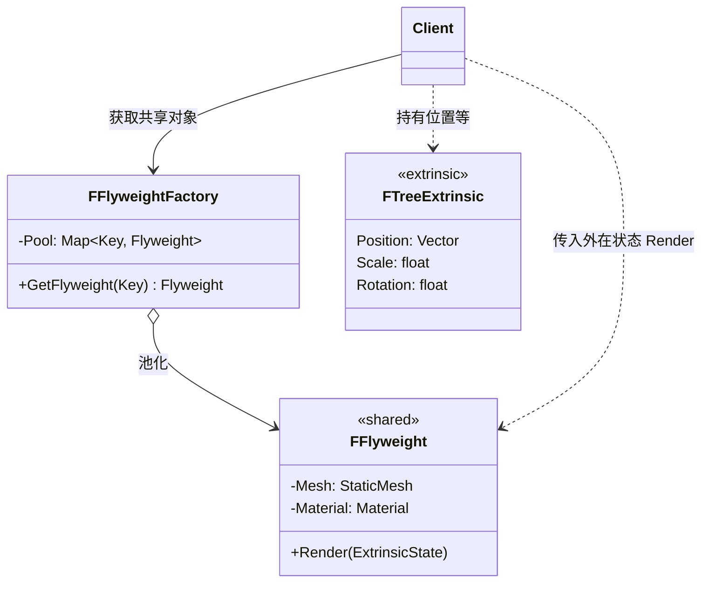

# 享元

## Flyweight

# 享元模式（Flyweight）深度透析

享元解决的核心问题是：**用共享技术高效支持大量细粒度对象**，把可共享的「内在状态」提取出来，避免重复存储。

------

## 1. 意图与本质

GoF 定义：运用共享技术有效地支持大量细粒度的对象。

用一句话说：

> **相同的部分只存一份，不同的部分外面传**

### 核心作用（简要）

1. **节省内存**：成千上万棵树/草/弹孔共用一个 Mesh/材质
2. **提高缓存命中**：共享数据更易留在 CPU/GPU 缓存
3. **分离状态**：内在（Intrinsic）vs 外在（Extrinsic）

------

## 2. 结构拆解

### UML 类图（标准关系）



### 内在 vs 外在状态

| 类型 | 含义 | 示例 | 存储位置 |
| :--- | :--- | :--- | :--- |
| **Intrinsic（内在）** | 可共享、不变 | 树的 Mesh、材质、碰撞体类型 | Flyweight 内部 |
| **Extrinsic（外在）** | 每实例不同 | 位置、旋转、缩放、Tint | 客户端 / 上下文传入 |

### 关系说明

| 角色 | 职责 |
| :--- | :--- |
| Flyweight | 共享内在状态，操作依赖外在状态参数 |
| FlyweightFactory | 按 key 创建/复用 Flyweight，保证共享 |
| Client | 维护外在状态，调用 Flyweight 时传入 |
| ExtrinsicState | 不放在 Flyweight 里的 per-instance 数据 |

------

## 3. 关键机制：工厂池化 + 外在状态外置

```cpp
struct FTreeKey {
    int MeshId;
    int MaterialId;
    bool operator==(const FTreeKey& O) const {
        return MeshId == O.MeshId && MaterialId == O.MaterialId;
    }
};

class FTreeFlyweight {
    UStaticMesh* Mesh;
    UMaterial* Material;
public:
    FTreeFlyweight(UStaticMesh* M, UMaterial* Mat) : Mesh(M), Material(Mat) {}

    void Render(const FVector& Pos, float Scale, float Rot) const {
        // 用共享 Mesh/Material + 外在 Pos/Scale/Rot 绘制
    }
};

class FTreeFlyweightFactory {
    TMap<FTreeKey, TSharedPtr<FTreeFlyweight>> Pool;

public:
    TSharedPtr<FTreeFlyweight> Get(const FTreeKey& Key) {
        if (TSharedPtr<FTreeFlyweight>* Found = Pool.Find(Key)) {
            return *Found;
        }
        auto FW = MakeShared<FTreeFlyweight>(LoadMesh(Key.MeshId), LoadMat(Key.MaterialId));
        Pool.Add(Key, FW);
        return FW;
    }
};

// 客户端：10000 棵树，可能只有 3 种 Flyweight
void DrawForest(const TArray<FTreeInstance>& Instances, FTreeFlyweightFactory& Factory) {
    for (const FTreeInstance& Inst : Instances) {
        auto FW = Factory.Get({Inst.MeshId, Inst.MaterialId});
        FW->Render(Inst.Position, Inst.Scale, Inst.Rotation);
    }
}
```

------

## 4. C++ 示例骨架（伤害飘字 / 字符串）

```cpp
// 内在：字体、样式（共享）
class FloatingTextFlyweight {
    UFont* Font;
    FLinearColor BaseColor;
public:
    FloatingTextFlyweight(UFont* F, FLinearColor C) : Font(F), BaseColor(C) {}

    void Display(const FString& Text, FVector WorldPos, float Lifetime) const {
        // Text/Pos/Lifetime 是外在状态
    }
};

class FFloatingTextFactory {
    TMap<int, TSharedPtr<FloatingTextFlyweight>> StylePool;
public:
    TSharedPtr<FloatingTextFlyweight> GetStyle(int StyleId) { /* ... */ }
};
```

------

## 5. 游戏开发中的典型应用场景

- **植被 / 实例化渲染**：同 Mesh 大量 Instance（HISM / ISM）
- **粒子 / 弹孔 / 弹壳**：共享资源，不同 Transform
- **TileMap / 体素**：相同方块类型共享定义
- **字符串 / 伤害数字**：共享字体材质，不同文本与位置
- **对象池**：常与 Flyweight 配合（池化实例，共享原型数据）

------

## 6. 与相关模式的边界

| 对比 | 享元 | 区别 |
| :--- | :--- | :--- |
| **原型** | 每个副本独立 | 享元**故意共享**，不独立复制内在状态 |
| **单例** | 全局一个实例 | 享元是**每种类/key 一个**，可多种 Flyweight |
| **对象池** | 复用对象实例 | 享元强调**共享不可变部分**；池强调复用生命周期 |
| **组合** | 树形结构 | 享元关注**内存共享** |

**记忆口诀**：
- 享元：**一样的数据只存一份**
- 原型：**每人一份独立拷贝**

------

## 7. 优点与代价

### 优点
1. 大幅减少内存占用
2. 适合海量相似对象（MMO、开放世界）
3. 共享资源利于 GPU Instancing

### 代价
1. 需仔细拆分内在/外在状态，设计复杂
2. 外在状态传递增加接口参数
3. 共享对象**不可随意修改**内在状态（否则全部实例受影响）
4. 多线程下共享 Flyweight 只读才安全

------

## 8. 在 Unreal Engine 中的对应思想

| 场景 | 近似实现 |
| :--- | :--- |
| HISM / ISM | 同 StaticMesh 大量实例，Transform 为外在状态 |
| `UInstancedStaticMeshComponent` | 引擎级 Flyweight + Instancing |
| DataAsset | 共享配置，实例引用 + 各自 Transform |
| String Table | 共享字符串资源 |
| Material Instance | 共享母材质，不同参数 |

------

## 9. 设计时该怎么用（实战 checklist）

1. 是否有**大量**相似对象？（成千上万）
2. 是否大量状态**可提取为共享**？（Mesh、贴图、配置）
3.  per-instance 差异能否外置为**外在状态**？
4. 共享部分是否**只读**或修改需 Copy-on-Write？

------

## 10. 常见反模式

| 反模式 | 问题 | 更好做法 |
| :--- | :--- | :--- |
| 把 Position 放进 Flyweight | 无法共享 | 外在状态外置 |
| 共享可变状态 | 改一个全变 | 内在只读或 COW |
| 对象很少也用 Flyweight | 过度设计 | 直接普通实例 |

------

## 11. 小结

享元 = **Factory 池化共享对象 + 内在状态内置 + 外在状态由客户端传入**。

一句话：**对象多到爆、且大量数据重复时，用享元共享内在状态。**
