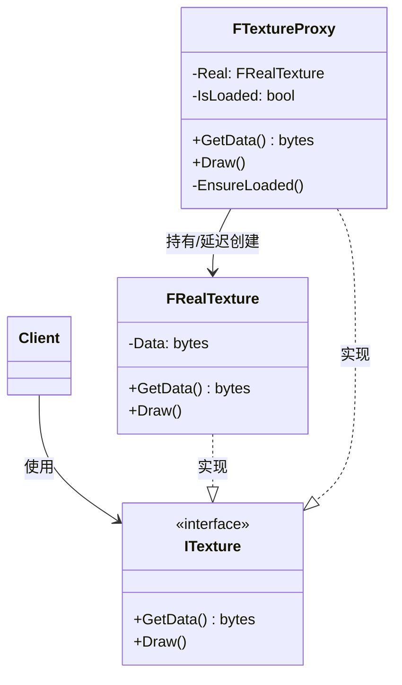

# 代理

## Proxy

# 代理模式（Proxy）深度透析

代理解决的核心问题是：**为其他对象提供一种代理以控制对这个对象的访问**（延迟加载、权限、缓存、远程等）。

------

## 1. 意图与本质

GoF 定义：为其他对象提供一种代理以控制对这个对象的访问。

用一句话说：

> **同接口替身，访问加管控**

### 核心作用（简要）

1. **延迟加载（Virtual Proxy）**：用时再创建重资源
2. **访问控制（Protection Proxy）**：权限检查
3. **远程代理（Remote Proxy）**：本地代表远程对象
4. **缓存（Cache Proxy）**：避免重复昂贵计算

------

## 2. 结构拆解

### UML 类图（标准关系）



### 常见代理类型

| 类型 | 作用 | 游戏例 |
| :--- | :--- | :--- |
| **Virtual Proxy** | 延迟创建昂贵对象 | 大图/关卡用时加载 |
| **Remote Proxy** | 代表远程对象 | 网络 replicated 占位 |
| **Protection Proxy** | 权限检查 | 仅 Host 可执行的操作 |
| **Cache Proxy** | 缓存结果 | 寻路、伤害计算缓存 |
| **Smart Reference** | 引用计数、Copy-on-Write | 智能指针思想 |

### 关系说明（UML 规范）

| 关系 | 本例 |
| :--- | :--- |
| **实现** | `Proxy ──▷ Subject`，`RealSubject ──▷ Subject` |
| **组合/关联** | `Proxy ──► RealSubject` |

> **常见错误**：Proxy 与 Decorator 混淆——Proxy **控制访问**，接口相同但**不改变核心语义**；Decorator **叠加职责**。

| 角色 | 职责 |
| :--- | :--- |
| Subject | 抽象接口，Real 与 Proxy 共同实现 |
| RealSubject | 真正干活的类 |
| Proxy | 同接口，控制何时/如何访问 RealSubject |
| Client | 只依赖 Subject，不区分 Real/Proxy |

------

## 3. 关键机制：同接口 + 控制访问

### Virtual Proxy（延迟加载）

```cpp
class ITexture {
public:
    virtual ~ITexture() = default;
    virtual void Draw() = 0;
};

class FRealTexture : public ITexture {
    TArray<uint8> Data;
public:
    FRealTexture() { /* 从磁盘加载，昂贵 */ }
    void Draw() override { /* 使用 Data 绘制 */ }
};

class FTextureProxy : public ITexture {
    mutable TUniquePtr<FRealTexture> Real;
    FString Path;

    FRealTexture& GetReal() const {
        if (!Real) Real = MakeUnique<FRealTexture>(); // 延迟
        return *Real;
    }

public:
    explicit FTextureProxy(FString InPath) : Path(MoveTemp(InPath)) {}
    void Draw() override { GetReal().Draw(); }
};
```

### Protection Proxy（权限）

```cpp
class FAdminServiceProxy : public IAdminService {
    IAdminService& Real;
    APlayerController* Caller;
public:
    void KickPlayer(int Id) override {
        if (!Caller->HasAuthority()) return;  // 访问控制
        Real.KickPlayer(Id);
    }
};
```

------

## 4. C++ 示例骨架（缓存代理）

```cpp
class IPathfinding {
public:
    virtual ~IPathfinding() = default;
    virtual TArray<FVector> FindPath(FVector From, FVector To) = 0;
};

class FNavMeshPathfinding : public IPathfinding {
public:
    TArray<FVector> FindPath(FVector From, FVector To) override {
        /* 昂贵 A* */
        return {};
    }
};

class FCachedPathfindingProxy : public IPathfinding {
    FNavMeshPathfinding& Real;
    TMap<uint64, TArray<FVector>> Cache;
public:
    explicit FCachedPathfindingProxy(FNavMeshPathfinding& R) : Real(R) {}

    TArray<FVector> FindPath(FVector From, FVector To) override {
        const uint64 Key = Hash(From, To);
        if (TArray<FVector>* Hit = Cache.Find(Key)) return *Hit;
        TArray<FVector> Path = Real.FindPath(From, To);
        Cache.Add(Key, Path);
        return Path;
    }
};
```

------

## 5. 游戏开发中的典型应用场景

- **资源异步加载**：Proxy 显示占位图，加载完换 Real
- **网络复制**：Client 上 Remote Proxy 代表 Server Actor
- **LOD / 流式加载**：远处用 Proxy，靠近再实例化完整 Actor
- **权限**：仅 Server 执行的 RPC 代理
- **智能指针**：`TSharedPtr` / `TWeakPtr` 可视为引用管理代理

------

## 6. 与相关模式的边界

| 对比 | 代理 | 区别 |
| :--- | :--- | :--- |
| **装饰器** | 增强功能，可多层 | 代理**控制访问**，通常一层代表 Real |
| **适配器** | 改接口 | 代理**接口相同** |
| **外观** | 协调多个子系统 | 代理**一对一**代表某个对象 |
| **享元** | 共享内在状态 | 代理**不强调共享**，强调访问控制 |

**记忆口诀**：
- 代理：**同接口，管访问、可延迟**
- 装饰：**同接口，加功能**
- 适配：**换接口，能对接**

------

## 7. 优点与代价

### 优点
1. 客户端无感，透明使用 Subject 接口
2. 延迟加载、权限、缓存等横切关注点集中
3. 可替换 RealSubject 而不改 Client

### 代价
1. 多一层间接，调试需区分 Proxy/Real
2. 与 Decorator 职责易混，设计需清晰
3. 远程代理需处理网络延迟、失败

------

## 8. 在 Unreal Engine 中的对应思想

| 场景 | 近似实现 |
| :--- | :--- |
| `TSoftObjectPtr` / Async Load | 延迟加载资源 |
| Replication Proxy | 客户端 Rep 对象代表 Server |
| `ALevelStreamingVolume` | 关卡流式加载 |
| `TWeakObjectPtr` | 弱引用代理，防悬空 |
| Stand-in Actor | 远处 Proxy Mesh，近处换真实 |

------

## 9. 设计时该怎么用（实战 checklist）

1. 是否需要**控制**对对象的访问时机/权限？
2. 创建/使用 Real 是否**昂贵**，可延迟？
3. 接口是否与 Real **完全一致**？（是 → Proxy；要改接口 → Adapter）
4. 是要**加功能**还是**管访问**？（前者 Decorator）

------

## 10. 常见反模式

| 反模式 | 问题 | 更好做法 |
| :--- | :--- | :--- |
| Proxy 里改业务语义 | 与 Decorator 混淆 | Proxy 只控制访问 |
| 每层都 Proxy | 调用链过深 | 按需使用 |
| Proxy 与 Real 生命周期混乱 | 悬空指针 | 明确所有权（UE WeakPtr） |

------

## 11. 小结

代理 = **实现与 RealSubject 相同接口 + 持有 Real + 在访问路径上加控制**。

一句话：**接口不变，但要延迟、保护、缓存或远程代表时，用代理。**
