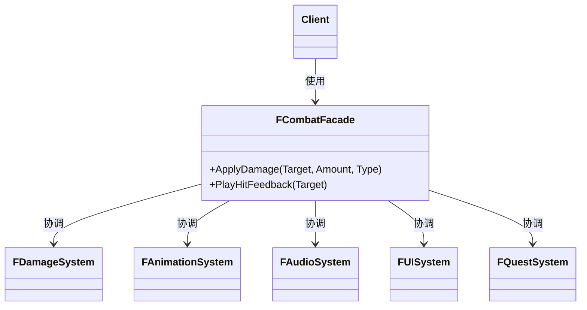

# 外观

## Facade

# 外观模式（Facade）深度透析

外观解决的核心问题是：**为复杂子系统提供一个简单、统一的入口**，降低客户端与子系统之间的耦合。

------

## 1. 意图与本质

GoF 定义：为子系统中的一组接口提供一个一致的界面，Facade 定义了一个高层接口，使得这一子系统更加容易使用。

用一句话说：

> **复杂系统，一个门口**

### 核心作用（简要）

1. **简化调用**：客户端一次调用，内部协调多个模块
2. **降低耦合**：客户端不直接依赖子系统每个类
3. **分层边界**：子系统内部可重构，Facade 接口稳定

------

## 2. 结构拆解

### UML 类图（标准关系）



### 关系说明（UML 规范）

| 关系 | 本例 |
| :--- | :--- |
| **关联** | `Client ──► Facade` |
| **关联/依赖** | `Facade ──► Subsystem`（内部调用，非继承） |

> **常见错误**：把 Facade 画成子系统的父类；Facade **不继承**子系统，只是**使用**它们。

| 角色 | 职责 |
| :--- | :--- |
| Facade | 对外简单接口，内部编排子系统 |
| Subsystem Classes | 实际干活的模块，Facade 不消除它们 |
| Client | 只与 Facade 交互（理想情况） |

------

## 3. 关键机制：编排而非替代

```cpp
class FCombatFacade {
    FDamageSystem& Damage;
    FAnimationSystem& Anim;
    FAudioSystem& Audio;
    FUISystem& UI;

public:
    FCombatFacade(FDamageSystem& D, FAnimationSystem& A,
                  FAudioSystem& Au, FUISystem& U)
        : Damage(D), Anim(A), Audio(Au), UI(U) {}

    void ApplyDamage(AActor* Target, float Amount, EDamageType Type) {
        const float Actual = Damage.Calculate(Target, Amount, Type);
        Damage.Apply(Target, Actual);
        Anim.PlayHitReact(Target);
        Audio.PlayHitSound(Target, Type);
        UI.ShowDamageNumber(Target, Actual);
    }
};

// 客户端
CombatFacade.ApplyDamage(Enemy, 50.f, EDamageType::Fire);
// 不必分别调 Damage、Anim、Audio、UI
```

------

## 4. C++ 示例骨架

```cpp
class FSaveFacade {
    FSerializeSystem& Serializer;
    FFileSystem& Files;
    FCompressionSystem& Compress;

public:
    bool SaveGame(const FString& Slot, const FSaveData& Data) {
        const TArray<uint8> Raw = Serializer.Serialize(Data);
        const TArray<uint8> Packed = Compress.Compress(Raw);
        return Files.Write(Slot, Packed);
    }

    TOptional<FSaveData> LoadGame(const FString& Slot) {
        auto Packed = Files.Read(Slot);
        if (!Packed) return {};
        auto Raw = Compress.Decompress(*Packed);
        return Serializer.Deserialize(*Raw);
    }
};
```

------

## 5. 游戏开发中的典型应用场景

- **战斗门面**：伤害 + 动画 + 音效 + 飘字 + 任务统计
- **存档门面**：序列化 + 压缩 + 写文件 + 云同步
- **网络门面**：封包 + 加密 + 发送 + 重试
- **启动/加载**：资源加载 + UI 进度 + 场景切换

------

## 6. 与相关模式的边界

| 对比 | 外观 | 区别 |
| :--- | :--- | :--- |
| **适配器** | 改一个类接口 | 外观**协调多个类**，接口是新的简化入口 |
| **中介者** | 对象互相不直接通信 | 外观是**单向**对外简化，子系统仍可互调 |
| **代理** | 控制单个对象访问 | 外观**包装整个子系统** |

**记忆口诀**：
- 外观：**对外一个入口，对内一堆模块**
- 适配器：**两个接口，中间翻译**

------

## 7. 优点与代价

### 优点
1. 客户端代码简洁
2. 子系统与客户端解耦
3. 便于分层与模块边界

### 代价
1. Facade 本身可能变成 **God Class**
2. 客户端若绕过 Facade 直接调子系统，耦合仍在
3. 过度封装可能隐藏必要细节

------

## 8. 在 Unreal Engine 中的对应思想

| 场景 | 近似实现 |
| :--- | :--- |
| `UGameplayStatics` | 封装常用 World/Actor 操作 |
| `AAuraHUD::InitOverlay` | 创建 Widget + Controller + 广播，协调多模块 |
| Subsystem | 作为某一领域的 Facade 入口 |
| Blueprint Function Library | 简化 C++ 子系统给 Blueprint 用 |

------

## 9. 设计时该怎么用（实战 checklist）

1. 客户端是否要调**很多子系统**才能完成一件事？
2. 是否希望对外只暴露**少量高层 API**？
3. Facade 是否只做**编排**，不塞满业务细节？
4. 是简化多模块还是转换接口？（后者用 Adapter）

------

## 10. 常见反模式

| 反模式 | 问题 | 更好做法 |
| :--- | :--- | :--- |
| Facade 变成万能类 | 难维护 | 按领域拆多个 Facade |
| Facade 里写核心算法 | 职责过重 | 算法留在 Subsystem |
| 所有代码都经 Facade | 性能/灵活性损失 | 允许底层模块直接协作 |

------

## 11. 小结

外观 = **一个类封装对多个子系统的调用，对外提供简单 API**。

一句话：**子系统太复杂、调用太散时，用 Facade 给一个统一入口。**
