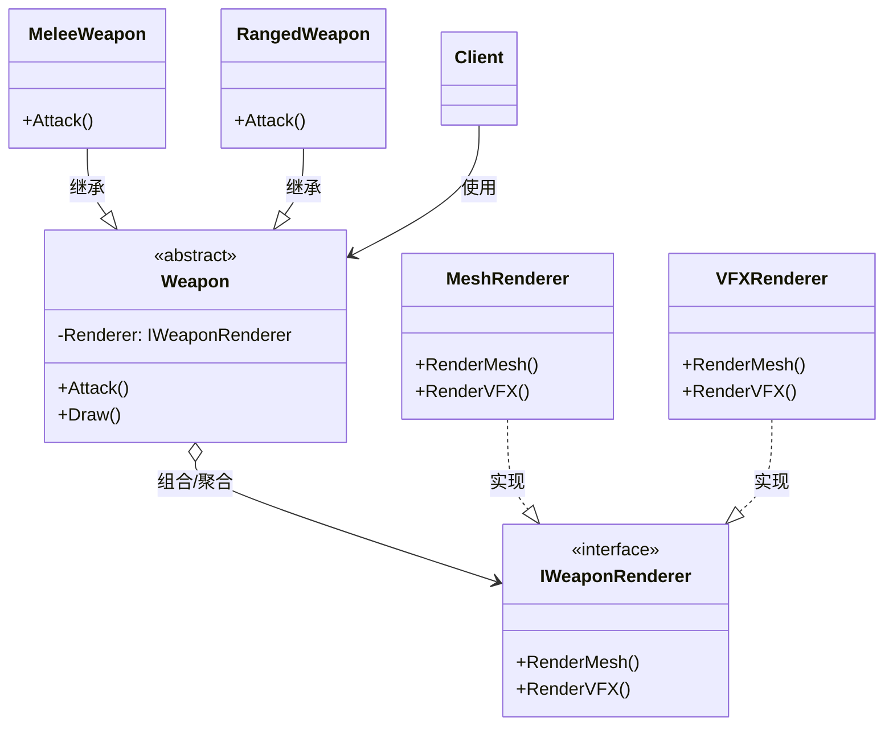

# 桥接

## Bridge

# 桥接模式（Bridge）深度透析

桥接解决的核心问题是：**把抽象与实现分离，使两者可以独立变化**，避免抽象与实现绑死导致类爆炸。

------

## 1. 意图与本质

GoF 定义：将抽象部分与它的实现部分分离，使它们都可以独立地变化。

用一句话说：

> **组合代替继承，抽象与实现解耦**

### 核心作用（简要）

1. **两个维度独立扩展**：如「武器逻辑 × 渲染方式」
2. **避免类爆炸**：不用 `SciFiMeleeRenderer`、`FantasyMeleeRenderer`… N×M 个子类
3. **运行时切换实现**：换渲染后端不必换武器类

------

## 2. 结构拆解

### UML 类图（标准关系）



### 关系说明（UML 规范）

| 关系 | 本例 |
| :--- | :--- |
| **继承** | `MeleeWeapon ──▷ Weapon`（抽象维度） |
| **实现** | `MeshRenderer ──▷ IWeaponRenderer`（实现维度） |
| **组合** | `Weapon` **持有** `IWeaponRenderer*`（桥） |

> **常见错误**：把 Implementor 画成 Abstraction 的子类；应是 **has-a 组合**，不是 is-a 继承。

| 角色 | 职责 |
| :--- | :--- |
| Abstraction（抽象） | 定义高层控制，持有 Implementor 引用 |
| RefinedAbstraction | 扩展抽象（如 MeleeWeapon） |
| Implementor（实现接口） | 定义实现层接口 |
| ConcreteImplementor | 具体实现（Mesh / VFX 渲染） |

------

## 3. 关键机制：组合桥

```cpp
class IWeaponRenderer {
public:
    virtual ~IWeaponRenderer() = default;
    virtual void RenderMesh() = 0;
    virtual void RenderVFX() = 0;
};

class AWeapon {
protected:
    IWeaponRenderer* Renderer;  // 桥：实现可替换
public:
    explicit AWeapon(IWeaponRenderer* R) : Renderer(R) {}
    virtual void Attack() = 0;
    void Draw() {
        Renderer->RenderMesh();
        Renderer->RenderVFX();
    }
};

class AMeleeWeapon : public AWeapon {
public:
    using AWeapon::AWeapon;
    void Attack() override { /* 近战逻辑 */ Draw(); }
};
```

运行时切换：`Weapon->SetRenderer(new VFXRenderer())`。

------

## 4. C++ 示例骨架

```cpp
// 实现维度：不同平台输入
class IInputImpl {
public:
    virtual ~IInputImpl() = default;
    virtual bool IsJumpPressed() = 0;
};

class FPCInputImpl : public IInputImpl {
    bool IsJumpPressed() override { /* 键盘 Space */ return false; }
};

class FGamepadInputImpl : public IInputImpl {
    bool IsJumpPressed() override { /* 手柄 A */ return false; }
};

// 抽象维度：角色控制
class ACharacterController {
    IInputImpl* Input;
public:
    explicit ACharacterController(IInputImpl* I) : Input(I) {}
    void Tick() {
        if (Input->IsJumpPressed()) Jump();
    }
    void Jump() { /* ... */ }
};
```

------

## 5. 游戏开发中的典型应用场景

- **渲染分离**：武器/角色逻辑 vs Mesh / Niagara / Decal 渲染
- **跨平台**： gameplay 不变，Input / File / Network 实现切换
- **AI 决策 vs 移动**：`IBrain` + `IMovementImpl`
- **音频**：Gameplay 事件 vs Wwise / 内置 Audio 实现

------

## 6. 与相关模式的边界

| 对比 | 桥接 | 区别 |
| :--- | :--- | :--- |
| **适配器** | 事后兼容旧接口 | 桥接**事前**设计两维分离 |
| **策略** | 替换**一种算法** | 桥接强调**抽象层 + 实现层**整体架构 |
| **装饰器** | 层层包装增强 | 桥接是**组合一个实现**，非嵌套链 |
| **抽象工厂** | 创建产品族 | 桥接关注**结构关系**，可配合使用 |

**记忆口诀**：
- 桥接：**两个维度，组合相连**
- 适配器：**两个接口，包装翻译**

------

## 7. 优点与代价

### 优点
1. 抽象与实现独立扩展
2. 避免 N×M 继承爆炸
3. 运行时可切换 Implementor

### 代价
1. 增加一层抽象，小项目可能过度
2. 需要事先识别「两个变化维度」
3. 理解成本高于简单继承

------

## 8. 在 Unreal Engine 中的对应思想

| 场景 | 近似实现 |
| :--- | :--- |
| Component 架构 | Actor（抽象）+ MeshComponent / MovementComponent（实现） |
| 接口 + 组件 | `IAbilitySystemInterface` + `UAbilitySystemComponent` |
| RHI | 渲染逻辑与 D3D/Vulkan/Metal 后端分离 |

------

## 9. 设计时该怎么用（实战 checklist）

1. 是否存在**两个独立变化维度**？（类型 × 平台/渲染）
2. 若用继承是否会导致**子类数量爆炸**？
3. 是否需要在**运行时切换实现**？
4. 是**结构设计**还是**接口兼容**？（后者用 Adapter）

------

## 10. 常见反模式

| 反模式 | 问题 | 更好做法 |
| :--- | :--- | :--- |
| 用继承绑死实现 | `SciFiMeleeWeapon` 类爆炸 | 组合 Implementor |
| 桥接与策略混为一谈 | 职责不清 | 桥接管结构，策略管算法 |
| 只有一个维度变化 | 过度设计 | 简单继承或策略即可 |

------

## 11. 小结

桥接 = **Abstraction 持有 Implementor 引用，两维独立扩展**。

一句话：**当「类型」和「实现方式」都要各自扩展时，用桥接组合，别用继承乘起来。**
