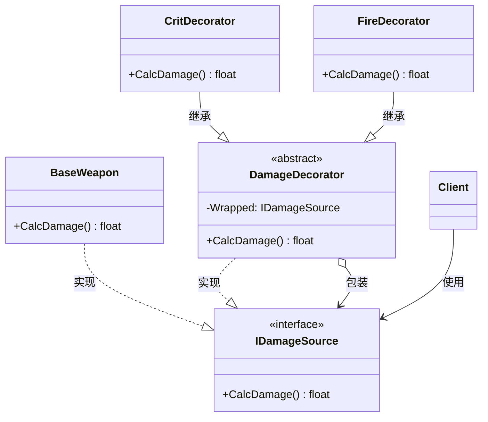

# 装饰器

## Decorator

# 装饰器模式（Decorator）深度透析

装饰器解决的核心问题是：**在不修改原类、不改变接口的前提下，动态地给对象叠加新职责**。

------

## 1. 意图与本质

GoF 定义：动态地给一个对象添加一些额外的职责。就增加功能来说，装饰器比生成子类更为灵活。

用一句话说：

> **同接口包装，一层层加料**

### 核心作用（简要）

1. **运行时组合行为**：Buff 可任意叠加，不必 `FireCritStunEnemy` 类爆炸
2. **开闭原则**：新增装饰 = 新 Decorator 类，不改原 Component
3. **可撤销**：去掉装饰层即移除效果

------

## 2. 结构拆解

### UML 类图（标准关系）



### 关系说明（UML 规范）

| 关系 | 本例 |
| :--- | :--- |
| **实现** | `BaseWeapon ──▷ IDamageSource` |
| **组合** | `DamageDecorator ──► IDamageSource`（持有被包装对象） |
| **继承** | `CritDecorator ──▷ DamageDecorator` |

> **常见错误**：Decorator 不实现与 Component 相同接口；客户端无法透明使用。

| 角色 | 职责 |
| :--- | :--- |
| Component | 统一接口 |
| ConcreteComponent | 原始对象 |
| Decorator | 实现 Component，持有 Component 引用，转发并扩展 |
| ConcreteDecorator | 具体增强（Crit、Fire、Stun） |

------

## 3. 关键机制：包装 + 委托 + 扩展

```cpp
class IDamageSource {
public:
    virtual ~IDamageSource() = default;
    virtual float CalcDamage() const = 0;
};

class FBaseWeapon : public IDamageSource {
public:
    float CalcDamage() const override { return 10.f; }
};

class FDamageDecorator : public IDamageSource {
protected:
    const IDamageSource& Wrapped;
public:
    explicit FDamageDecorator(const IDamageSource& W) : Wrapped(W) {}
    float CalcDamage() const override { return Wrapped.CalcDamage(); }
};

class FCritDecorator : public FDamageDecorator {
    float CritMultiplier;
public:
    FCritDecorator(const IDamageSource& W, float Mult)
        : FDamageDecorator(W), CritMultiplier(Mult) {}
    float CalcDamage() const override {
        return FDamageDecorator::CalcDamage() * CritMultiplier;
    }
};

// 使用：火焰 + 暴击
FBaseWeapon Base;
FFireDecorator Fire{Base};
FCritDecorator Crit{Fire, 2.0f};
float Dmg = Crit.CalcDamage();  // (10 + Fire) * 2
```

------

## 4. C++ 示例骨架（Buff 链）

```cpp
class ICharacterStats {
public:
    virtual ~ICharacterStats() = default;
    virtual float GetMoveSpeed() const = 0;
};

class FBaseStats : public ICharacterStats {
    float Speed = 600.f;
public:
    float GetMoveSpeed() const override { return Speed; }
};

class FBuffDecorator : public ICharacterStats {
protected:
    const ICharacterStats& Inner;
public:
    explicit FBuffDecorator(const ICharacterStats& I) : Inner(I) {}
    float GetMoveSpeed() const override { return Inner.GetMoveSpeed(); }
};

class FHasteBuff : public FBuffDecorator {
    float Bonus;
public:
    FHasteBuff(const ICharacterStats& I, float B) : FBuffDecorator(I), Bonus(B) {}
    float GetMoveSpeed() const override {
        return FBuffDecorator::GetMoveSpeed() + Bonus;
    }
};
```

------

## 5. 游戏开发中的典型应用场景

- **Buff / Debuff 叠加**：移速、攻击、护甲等可组合
- **武器附魔**：基础伤害 + 火焰 + 暴击 + 吸血
- **输入修饰**：冲刺、瞄准、减速模式包装基础输入
- **UI 装饰**：带 Tooltip、红点、禁用态的 Button 包装

------

## 6. 与相关模式的边界

| 对比 | 装饰器 | 区别 |
| :--- | :--- | :--- |
| **适配器** | 改接口 | 装饰器**接口不变** |
| **代理** | 控制访问 | 装饰器**增强功能** |
| **组合** | 树形 part-whole | 装饰器通常是**链式包装** |
| **继承** | 编译期固定 | 装饰器**运行时可叠** |

**记忆口诀**：
- 装饰器：**同接口，包一层加功能**
- 代理：**同接口，管访问**
- 适配器：**换接口，能协作**

------

## 7. 优点与代价

### 优点
1. 比继承灵活，运行时任意组合
2. 符合开闭原则
3. 可逐层添加/移除

### 代价
1. 多层装饰调试困难（调用链深）
2. 小对象多时可能有性能/内存开销
3. 构造函数顺序影响叠加顺序，需文档说明

------

## 8. 在 Unreal Engine 中的对应思想

| 场景 | 近似实现 |
| :--- | :--- |
| GAS GameplayEffect | 多个 GE 叠加修改 Attribute |
| GameplayAbility | 修饰技能行为 |
| `UMaterialInstance` | 材质层叠 |
| Blueprint 包装 | 外层 BP 调用内层并扩展 |

------

## 9. 设计时该怎么用（实战 checklist）

1. 是否需要**动态、可组合**地叠加行为？
2. 叠加后是否仍用**同一接口**对外？
3. 组合数量是否会导致**子类爆炸**？（是 → Decorator）
4. 是增强还是控制访问？（后者用 Proxy）

------

## 10. 常见反模式

| 反模式 | 问题 | 更好做法 |
| :--- | :--- | :--- |
| 装饰链过深 | 难调试、性能差 | 限制层数或合并常用组合 |
| 装饰器里改 Wrapped 状态 | 破坏封装 | 只通过接口委托 |
| 与继承混用同一职责 | 重复逻辑 | 统一用一种扩展方式 |

------

## 11. 小结

装饰器 = **实现同一接口 + 持有 Component + 委托并增强**。

一句话：**接口不变，运行时一层层加能力，用装饰器。**
