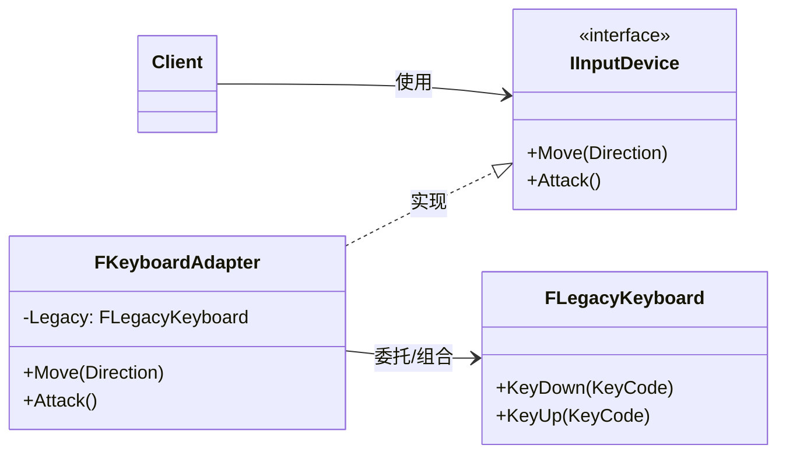

# 适配器

## Adapter

# 适配器模式（Adapter）深度透析

适配器解决的核心问题是：**两个接口不兼容的类，如何让它们一起工作**，而不修改原有代码。

------

## 1. 意图与本质

GoF 定义：将一个类的接口转换成客户希望的另一个接口。适配器使原本接口不兼容的类可以一起工作。

用一句话说：

> **包一层，翻译接口**

### 核心作用（简要）

1. **接口转换**：旧 API → 新 API，第三方 SDK → 项目统一接口
2. **复用已有类**：不必重写 Legacy 代码
3. **解耦客户端与具体实现**：客户端只依赖 Target 接口

------

## 2. 结构拆解

### UML 类图（标准关系）



### 两种实现方式

| 方式 | 结构 | C++ | 特点 |
| :--- | :--- | :--- | :--- |
| **对象适配器** | Adapter **持有** Adaptee | 组合 `Adaptee*` | **推荐**，更灵活 |
| **类适配器** | Adapter **继承** Adaptee + Target | 多重继承 | 较少用，耦合 Adaptee 具体类 |

### 关系说明（UML 规范）

| 关系 | 本例 |
| :--- | :--- |
| **实现** `──▷` | `FKeyboardAdapter ──▷ IInputDevice` |
| **组合/关联** | `FKeyboardAdapter ──► FLegacyKeyboard`（内部翻译调用） |
| **依赖** | `Client ──► IInputDevice` |

> **常见错误**：把 Adapter 画成 Adaptee 继承 Target；应是 Adapter **实现 Target**，**持有/继承 Adaptee** 并转发。

| 角色 | 职责 |
| :--- | :--- |
| Target（目标接口） | 客户端期望的接口 |
| Adaptee（被适配者） | 已有但接口不兼容的类 |
| Adapter（适配器） | 实现 Target，内部调用 Adaptee |
| Client | 只依赖 Target |

------

## 3. 关键机制：翻译调用

```cpp
// 新接口
class IInputDevice {
public:
    virtual ~IInputDevice() = default;
    virtual void Move(FVector2D Dir) = 0;
    virtual void Attack() = 0;
};

// 旧系统
class FLegacyKeyboard {
public:
    void KeyDown(int KeyCode) { /* ... */ }
};

// 适配器：Move/Attack → KeyDown
class FKeyboardAdapter : public IInputDevice {
    FLegacyKeyboard& Legacy;
public:
    explicit FKeyboardAdapter(FLegacyKeyboard& In) : Legacy(In) {}

    void Move(FVector2D Dir) override {
        if (Dir.X > 0) Legacy.KeyDown('D');
        if (Dir.X < 0) Legacy.KeyDown('A');
        // ...
    }
    void Attack() override { Legacy.KeyDown(VK_SPACE); }
};
```

------

## 4. C++ 示例骨架

```cpp
class IPlatformAchievements {
public:
    virtual ~IPlatformAchievements() = default;
    virtual void Unlock(const FString& Id) = 0;
};

class FSteamAPI {
public:
    void SetAchievement(const char* Name) { /* Steam SDK */ }
};

class FSteamAchievementAdapter : public IPlatformAchievements {
    FSteamAPI& Steam;
public:
    explicit FSteamAchievementAdapter(FSteamAPI& In) : Steam(In) {}
    void Unlock(const FString& Id) override {
        Steam.SetAchievement(TCHAR_TO_UTF8(*Id));
    }
};
```

------

## 5. 游戏开发中的典型应用场景

- **第三方 SDK**：Steam / EOS 成就、支付、登录 → 统一 `IPlatformService`
- **旧模块接入新架构**：Legacy 战斗公式 → 新 GAS Attribute 接口
- **数据格式转换**：JSON 存档 → 新 `ISaveSystem`
- **跨平台输入**：Switch / Xbox / PC 输入 → 统一 `IInputDevice`

------

## 6. 与相关模式的边界

| 对比 | 适配器 | 区别 |
| :--- | :--- | :--- |
| **装饰器** | 增强功能，接口不变 | 适配器**改变接口**以兼容 |
| **桥接** | 事前分离抽象与实现 | 适配器**事后**兼容已有类 |
| **外观** | 简化多个类的调用 | 适配器**转换**单个类接口 |
| **代理** | 控制访问，接口相同 | 适配器**接口不同** |

**记忆口诀**：
- 适配器：**接口对不上，包一层翻译**
- 装饰器：**接口一样，多加功能**

------

## 7. 优点与代价

### 优点
1. 复用已有代码，不必重写
2. 客户端与 Adaptee 解耦
3. 符合开闭原则（新增 Adapter 不改 Client）

### 代价
1. 多一层间接，调试要穿透 Adapter
2. 类适配器用多重继承时结构复杂
3. 有时只是掩盖设计问题，应评估是否该重构 Adaptee

------

## 8. 在 Unreal Engine 中的对应思想

| 场景 | 近似实现 |
| :--- | :--- |
| 插件封装 | 第三方插件 → 项目 `UInterface` |
| Enhanced Input | 旧 Input 绑定 → Enhanced Input Mapping |
| 序列化 | 旧 SaveGame → 新 DataAsset 格式转换层 |

------

## 9. 设计时该怎么用（实战 checklist）

1. 是否已有类/API **不能改**，但接口**不匹配**？
2. 客户端是否应只依赖**统一 Target 接口**？
3. 是**转换接口**还是**增强功能**？（后者用 Decorator）
4. 能否直接重构 Adaptee？（能则不必 Adapter）

------

## 10. 常见反模式

| 反模式 | 问题 | 更好做法 |
| :--- | :--- | :--- |
| Adapter 里写业务逻辑 | 职责混乱 | 只做接口翻译 |
| 到处 new Adapter | 难管理 | 工厂/DI 注入 |
| 用 Adapter 掩盖烂设计 | 技术债累积 | 评估是否重构 Adaptee |

------

## 11. 小结

适配器 = **Target 接口 + 内部持有 Adaptee + 转发翻译**。

一句话：**接口不兼容又想复用旧代码时，用适配器。**
