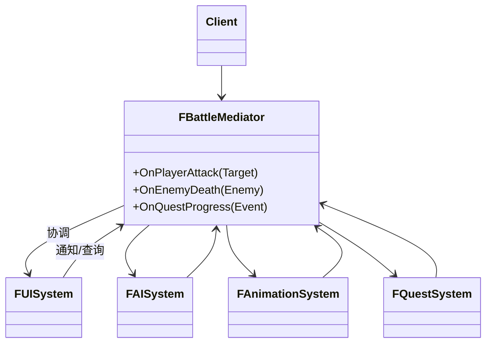

# 中介者

## Mediator

# 中介者模式（Mediator）深度透析

中介者解决的核心问题是：**对象之间不直接互相引用，而通过中介者通信**，避免网状依赖。

------

## 1. 意图与本质

GoF 定义：用一个中介对象来封装一系列的对象交互。中介者使各对象不需要显式地相互引用，从而使其耦合松散，而且可以独立地改变它们之间的交互。

用一句话说：

> **多对象通信，走一个中枢**

### 核心作用（简要）

1. **打破网状依赖**：UI、AI、动画不互相 `#include`
2. **集中协调逻辑**：战斗流程、房间状态
3. **易改交互规则**：只改 Mediator

------

## 2. 结构拆解

### UML 类图（标准关系）



| 角色 | 职责 |
| :--- | :--- |
| Mediator | 定义 Colleague 间交互接口 |
| ConcreteMediator | 实现协调逻辑 |
| Colleague | 只与 Mediator 通信，不直接互调 |
| Client | 通过 Mediator 驱动 |

> **与 Facade 区别**：Facade 是**对外简化**；Mediator 是**同事对象之间**通过中心协调，子系统仍可复杂。

------

## 3. 关键机制

```cpp
class FBattleMediator {
    FUISystem& UI;
    FAISystem& AI;
    FQuestSystem& Quest;

public:
    void OnEnemyDeath(AEnemy* Enemy) {
        UI.ShowKillFeedback(Enemy);
        AI.OnTargetLost(Enemy);
        Quest.NotifyKill(Enemy->GetId());
    }
};

// Colleague 不直接调 QuestSystem，只调 Mediator
class AEnemy {
    FBattleMediator* Mediator;
public:
    void Die() { Mediator->OnEnemyDeath(this); }
};
```

------

## 4. 游戏开发场景

- **战斗协调**：伤害 → UI + AI + 任务 + 音效
- **多人房间**：玩家状态经 RoomMediator 同步
- **UI 模块**：MVC 中 Controller 类似 Mediator
- **聊天/匹配**：频道、Lobby 中介

------

## 5. 与相关模式边界

| 对比 | 中介者 | 区别 |
| :--- | :--- | :--- |
| **外观** | 对外一个简单入口 | 中介者协调**多个对等 Colleague** |
| **观察者** | 一对多广播 | 中介者**双向协调**，逻辑更复杂 |
| **责任链** | 线性传递 | 中介者**星型**中心路由 |

------

## 6. 优点与代价

**优点**：降耦合、交互集中、易改规则。  
**代价**：Mediator 易变 God Class、单点复杂度。

------

## 7. UE 对应

`AAuraHUD` + WidgetController 协调 UI 与 GAS；GameMode 协调规则；Subsystems 作领域中介。

------

## 11. 小结

一句话：**对象太多互相引用时，用 Mediator 统一协调。**
