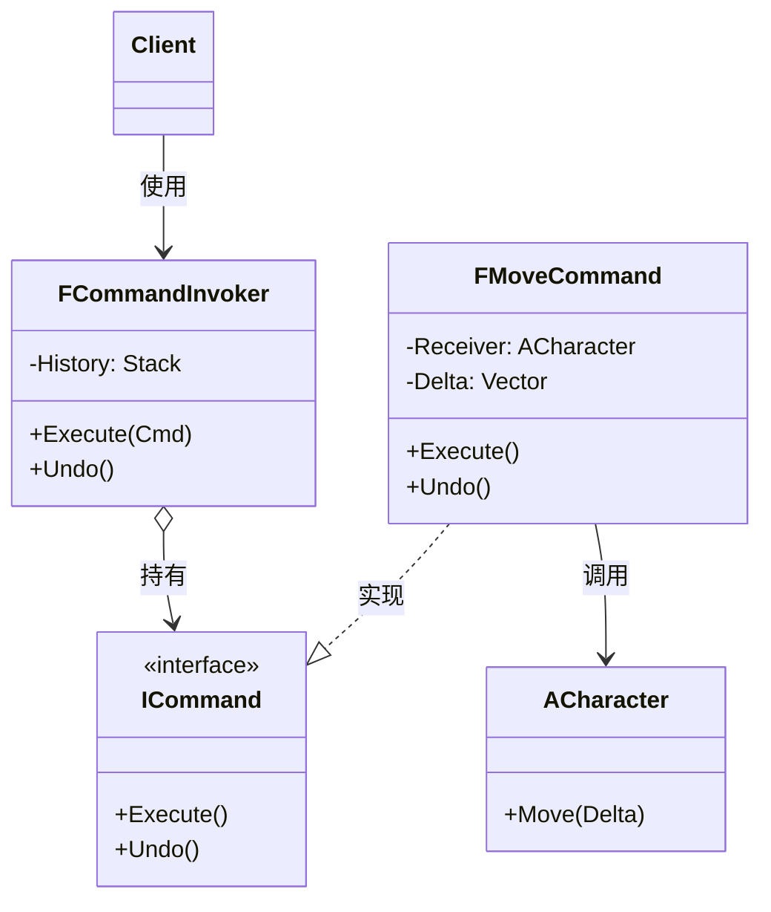

# 命令

## Command

# 命令模式（Command）深度透析

命令解决的核心问题是：**把请求封装成对象**，从而支持撤销、队列、日志、宏与网络同步。

------

## 1. 意图与本质

GoF 定义：将一个请求封装为一个对象，从而用不同的请求对客户进行参数化；对请求排队或记录请求日志，以及支持可撤销的操作。

用一句话说：

> **操作变成对象，可存、可排队、可撤销**

### 核心作用（简要）

1. **解耦调用者与执行者**：Invoker 不直接调 Receiver
2. **撤销 / 重做**：Undo/Redo 栈
3. **命令队列**：帧同步、输入缓冲、AI 指令队列
4. **宏与回放**：录制 Command 序列重放

------

## 2. 结构拆解

### UML 类图（标准关系）



| 角色 | 职责 |
| :--- | :--- |
| Command | 声明 Execute / Undo |
| ConcreteCommand | 绑定 Receiver 与参数 |
| Invoker | 触发命令、维护历史 |
| Receiver | 真正执行逻辑的对象 |
| Client | 创建并提交命令 |

------

## 3. 关键机制

```cpp
class ICommand {
public:
    virtual ~ICommand() = default;
    virtual void Execute() = 0;
    virtual void Undo() = 0;
};

class FMoveCommand : public ICommand {
    ACharacter* Char;
    FVector Delta;
public:
    FMoveCommand(ACharacter* C, FVector D) : Char(C), Delta(D) {}
    void Execute() override { Char->Move(Delta); }
    void Undo() override { Char->Move(-Delta); }
};

class FCommandInvoker {
    TArray<TUniquePtr<ICommand>> UndoStack;
public:
    void Execute(TUniquePtr<ICommand> Cmd) {
        Cmd->Execute();
        UndoStack.Add(MoveTemp(Cmd));
    }
    void Undo() {
        if (UndoStack.Num()) UndoStack.Pop()->Undo();
    }
};
```

------

## 4. 游戏开发场景

- **输入回放 / 帧同步**：每帧 Command 队列 determinism
- **技能释放**：CastSkillCommand 入队
- **编辑器 Undo/Redo**：变换、放置、删除
- **AI 指令**：MoveTo、Attack 封装为 Command
- **网络**：客户端发 Command，服务端 Execute

------

## 5. 与相关模式边界

| 对比 | 命令 | 区别 |
| :--- | :--- | :--- |
| **策略** | 封装算法 | 命令封装**完整操作+参数+Undo** |
| **责任链** | 传递请求 | 命令是**独立对象**，通常一次 Execute |
| **备忘录** | 保存状态 | 命令用 Undo 恢复，Memento 存快照 |

------

## 6. 优点与代价

**优点**：解耦、可撤销、可排队、可日志。  
**代价**：命令类数量多、内存（历史栈）、Undo 设计复杂。

------

## 7. UE 对应

`UInputAction` 回调、编辑器 Transaction、网络 RPC 参数化、GameplayAbility 激活可视为命令变体。

------

## 11. 小结

一句话：**把「做什么」封成对象，就能排队、撤销、回放。**
