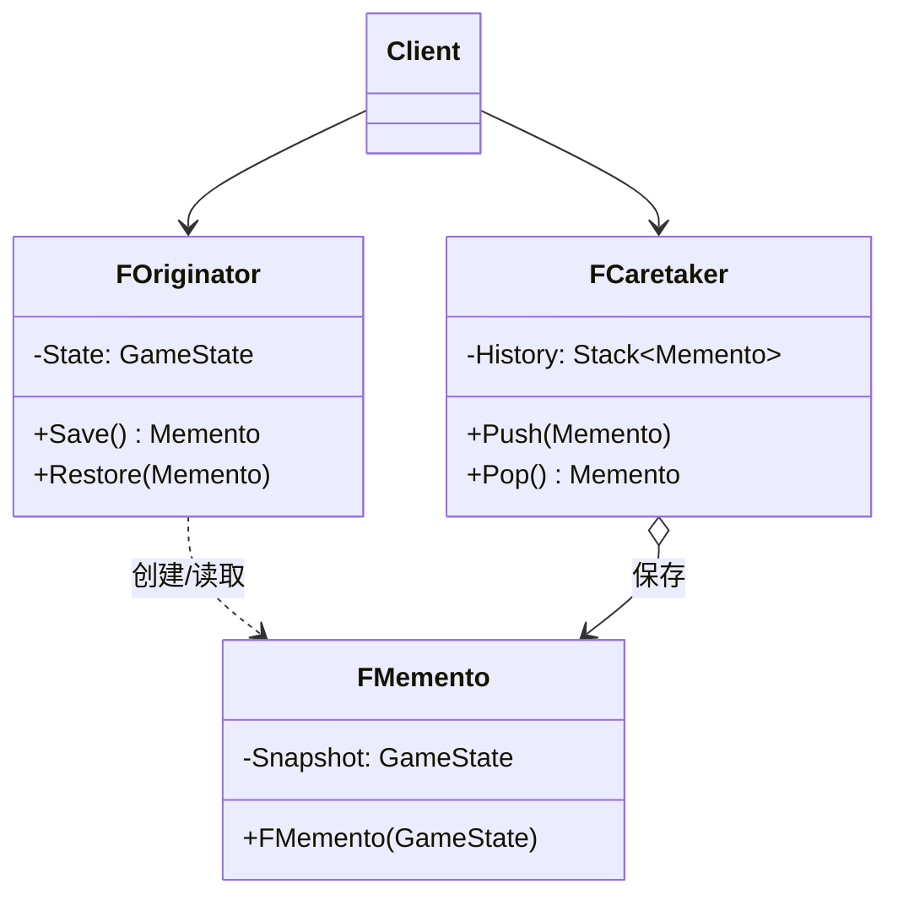

# 备忘录

## Memento

# 备忘录模式（Memento）深度透析

备忘录解决的核心问题是：**在不破坏封装的前提下，捕获对象内部状态并在之后恢复**（存档、Undo）。

------

## 1. 意图与本质

GoF 定义：在不破坏封装性的前提下，捕获一个对象的内部状态，并在该对象之外保存这个状态，以便以后可将对象恢复到原先的状态。

用一句话说：

> **存快照，可回滚，不暴露内部细节**

### 核心作用（简要）

1. **Undo / Redo**：编辑器、游戏内撤销
2. **存档 / 读档**：保存玩家状态
3. **AI 搜索 / 回溯**：保存决策点状态

------

## 2. 结构拆解

### UML 类图（标准关系）



| 角色 | 职责 |
| :--- | :--- |
| Originator | 创建 Memento、从 Memento 恢复 |
| Memento | 存储 Originator 内部状态快照 |
| Caretaker | 管理 Memento 栈/列表，不修改内容 |
| Client | 触发 Save/Restore |

> Memento 对 Caretaker **只读**；只有 Originator 能解释快照含义。

------

## 3. 关键机制

```cpp
class FPlayerMemento {
    friend class APlayerCharacter;
    FPlayerStats Snapshot;
    explicit FPlayerMemento(FPlayerStats S) : Snapshot(MoveTemp(S)) {}
};

class APlayerCharacter {
    FPlayerStats State;
public:
    FPlayerMemento Save() const { return FPlayerMemento(State); }
    void Restore(const FPlayerMemento& M) { State = M.Snapshot; }
};

class FUndoManager {
    TArray<FPlayerMemento> Stack;
public:
    void Push(const FPlayerMemento& M) { Stack.Add(M); }
    TOptional<FPlayerMemento> Pop() {
        if (Stack.Num() == 0) return {};
        FPlayerMemento M = Stack.Pop();
        return M;
    }
};
```

------

## 4. 游戏开发场景

- **存档系统**：玩家位置、背包、任务进度快照
- **编辑器 Undo**：Transform、属性修改
- **回合制**：回合开始存 Memento，悔棋 Restore
- **调试**：Checkpoint 回滚

------

## 5. 与相关模式边界

| 对比 | 备忘录 | 区别 |
| :--- | :--- | :--- |
| **命令** | Undo 用反向 Execute | Memento **存状态快照**，不依赖逆操作 |
| **原型** | 克隆活跃对象 | Memento 是**被动快照**，由 Caretaker 保管 |
| **序列化** | 持久化到磁盘 | Memento 强调**封装+恢复**，常内存栈 |

------

## 6. 优点与代价

**优点**：保持封装、恢复简单、Caretaker 与状态解耦。  
**代价**：快照体积、版本兼容、频繁保存内存开销。

------

## 7. UE 对应

`USaveGame`、`FTransaction`（编辑器 Undo）、`CopyPropertiesForPlayInEditor`、Replay 系统。

------

## 11. 小结

一句话：**要撤销/存档又不想暴露内部结构，用 Memento 存快照。**
