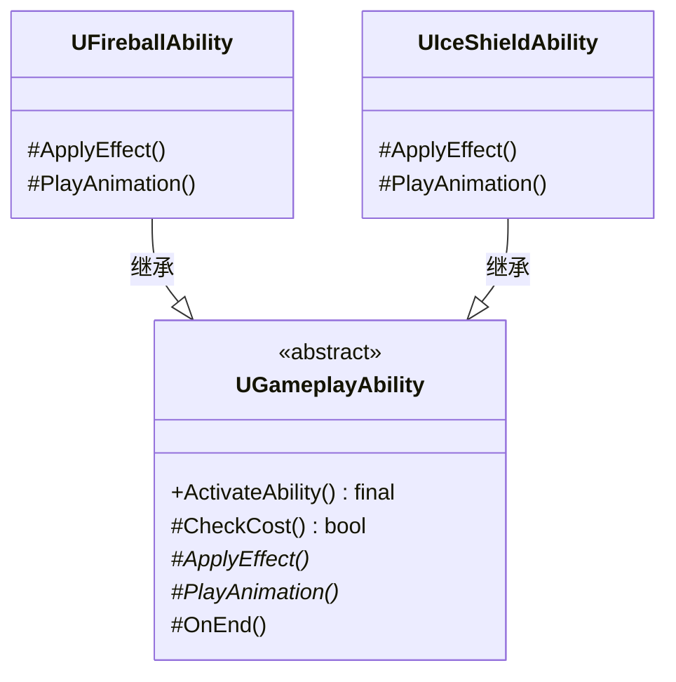

# 模板方法

## Template Method

# 模板方法模式（Template Method）深度透析

模板方法解决的核心问题是：**在父类中定义算法骨架，子类重写某些步骤**，复用流程、可变细节。

------

## 1. 意图与本质

GoF 定义：定义一个操作中的算法的骨架，而将一些步骤延迟到子类中。Template Method 使得子类可以不改变一个算法的结构即可重定义该算法的某些特定步骤。

用一句话说：

> **流程固定，步骤可换**

### 核心作用（简要）

1. **复用算法结构**：Execute 流程不变
2. **钩子扩展点**：子类 override 单步
3. **控制扩展顺序**：Hollywood Principle — 别调用我们，我们会调用你

------

## 2. 结构拆解

### UML 类图（标准关系）



| 角色 | 职责 |
| :--- | :--- |
| AbstractClass | 模板方法 `TemplateMethod()` + 抽象/钩子步骤 |
| ConcreteClass | 实现或重写特定步骤 |
| Client | 调用模板方法 |

> 模板方法通常为 **final/non-virtual**，子类只改步骤不改编排。

------

## 3. 关键机制

```cpp
class UGameplayAbility {
public:
    void ActivateAbility() {  // 模板方法 — 流程固定
        if (!CheckCost()) return;
        PlayAnimation();
        ApplyEffect();
        OnEnd();
    }
protected:
    virtual bool CheckCost() { return true; }      // 钩子，可 override
    virtual void PlayAnimation() = 0;            // 抽象步骤
    virtual void ApplyEffect() = 0;
    virtual void OnEnd() {}
};

class UFireballAbility : public UGameplayAbility {
protected:
    void PlayAnimation() override { /* 火球动画 */ }
    void ApplyEffect() override { /* 火焰伤害 */ }
};
```

------

## 4. 游戏开发场景

- **技能释放流程**：CheckCost → Anim → Effect → Cooldown
- **关卡加载**：LoadAssets → InitActors → BeginPlay
- **AI Tick**：Sense → Decide → Act
- **存档**：SerializeHeader → SerializeBody → WriteFooter

------

## 5. 与相关模式边界

| 对比 | 模板方法 | 区别 |
| :--- | :--- | :--- |
| **策略** | 组合替换整个算法 | 模板方法**继承固定骨架**，换部分步骤 |
| **工厂方法** | 子类决定创建什么 | 模板方法管**执行流程** |
| **钩子 vs 抽象** | 钩子有默认实现 | 抽象步骤子类必须实现 |

**记忆口诀**：
- 模板方法：**继承，流程不变**
- 策略：**组合，整个算法可换**

------

## 6. 优点与代价

**优点**：复用流程、扩展点清晰、减少重复。  
**代价**：继承耦合、子类受父类骨架限制、灵活度不如 Strategy。

------

## 7. UE 对应

`UGameplayAbility::ActivateAbility`、`AActor::BeginPlay` 链、`UAnimInstance::NativeUpdateAnimation`、Component `InitializeComponent`。

------

## 11. 小结

一句话：**算法步骤顺序固定，把变化的部分留给子类 override。**
