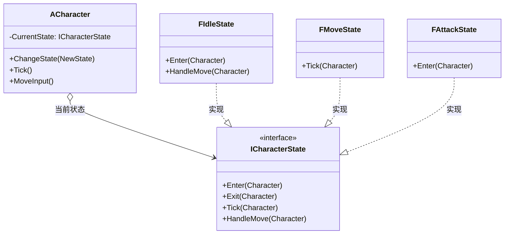

# 状态

## State

# 状态模式（State）深度透析

状态模式解决的核心问题是：**对象行为随内部状态改变，把每个状态的行为拆成独立类**，消除巨大 switch/if。

------

## 1. 意图与本质

GoF 定义：允许一个对象在其内部状态改变时改变它的行为。对象看起来似乎修改了它的类。

用一句话说：

> **状态变类，行为跟着换**

### 核心作用（简要）

1. **消除状态分支**：不用 `if (State == Idle) ... else if (Attack)`
2. **状态转换清晰**：Idle → Move → Attack
3. **每状态封装进入/退出逻辑**

------

## 2. 结构拆解

### UML 类图（标准关系）



| 角色 | 职责 |
| :--- | :--- |
| Context | 持有当前 State，委托行为 |
| State | 抽象状态接口 |
| ConcreteState | 各状态具体行为与转换 |

------

## 3. 关键机制

```cpp
class ACharacter;

class ICharacterState {
public:
    virtual ~ICharacterState() = default;
    virtual void Enter(ACharacter* C) {}
    virtual void Exit(ACharacter* C) {}
    virtual void Tick(ACharacter* C) {}
    virtual void HandleMove(ACharacter* C) {}
};

class FIdleState : public ICharacterState {
public:
    void HandleMove(ACharacter* C) override;
};

class ACharacter {
    TUniquePtr<ICharacterState> State;
public:
    void ChangeState(TUniquePtr<ICharacterState> New) {
        State->Exit(this);
        State = MoveTemp(New);
        State->Enter(this);
    }
    void Tick() { State->Tick(this); }
};
```

------

## 4. 游戏开发场景

- **角色状态机**：Idle / Move / Jump / Attack / Stun / Die
- **AI 状态**：Patrol / Chase / Attack / Flee
- **UI 交互**：Normal / Hover / Pressed / Disabled
- **网络连接**：Connecting / Connected / Disconnected

------

## 5. 与相关模式边界

| 对比 | 状态 | 区别 |
| :--- | :--- | :--- |
| **策略** | 替换算法，客户端主动选 | 状态**随 Context 内部变化自动切换** |
| **命令** | 封装操作 | 状态封装**行为+转换** |
| **UE AnimInstance** | 动画状态机 | 同理，可代码 State 类实现 |

**记忆口诀**：
- 状态：**我是谁 → 行为整套变**
- 策略：**怎么做 X → 算法可换**

------

## 6. 优点与代价

**优点**：结构清晰、易加状态、符合开闭。  
**代价**：状态类增多、转换表要维护、简单 2～3 状态可能过度。

------

## 7. UE 对应

`UAnimInstance` 状态机、AI Behavior Tree（Task/Composite）、Character Movement Mode、`UGameplayAbility` 激活状态。

------

## 11. 小结

一句话：**行为随状态变，就把每个状态做成独立类。**
