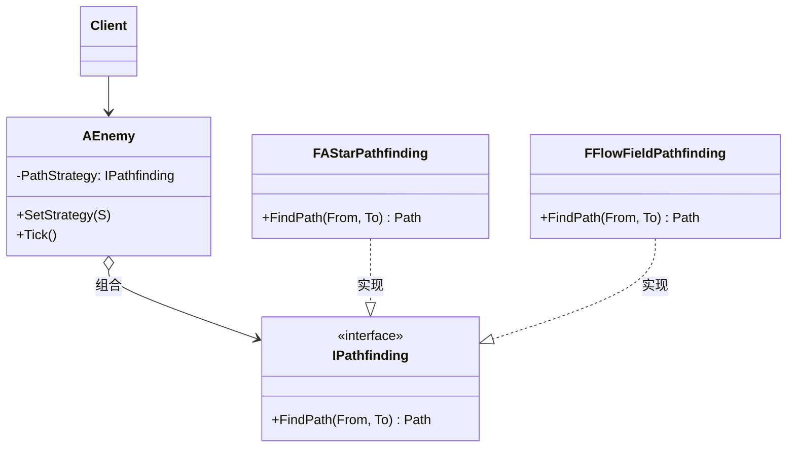

# 策略

## Strategy

# 策略模式（Strategy）深度透析

策略解决的核心问题是：**封装可互换的算法/行为，运行时切换，而不改客户端代码**。

------

## 1. 意图与本质

GoF 定义：定义一系列的算法，把它们一个个封装起来，并且使它们可相互替换。Strategy 使算法可独立于使用它的客户而变化。

用一句话说：

> **算法打包，随时换**

### 核心作用（简要）

1. **运行时切换算法**：A* / FlowField / NavMesh
2. **消除条件分支**：不用 `if (Easy) ... else if (Hard)`
3. **独立测试每种策略**

------

## 2. 结构拆解

### UML 类图（标准关系）



| 角色 | 职责 |
| :--- | :--- |
| Strategy | 算法接口 |
| ConcreteStrategy | 具体算法实现 |
| Context | 持有 Strategy，委托调用 |
| Client | 配置 Context 使用哪种 Strategy |

------

## 3. 关键机制

```cpp
class IPathfinding {
public:
    virtual ~IPathfinding() = default;
    virtual TArray<FVector> FindPath(FVector From, FVector To) = 0;
};

class FAStar : public IPathfinding {
public:
    TArray<FVector> FindPath(FVector From, FVector To) override { /* A* */ return {}; }
};

class AEnemy {
    TUniquePtr<IPathfinding> Strategy;
public:
    void SetStrategy(TUniquePtr<IPathfinding> S) { Strategy = MoveTemp(S); }
    void Tick() {
        auto Path = Strategy->FindPath(GetLocation(), Target);
        Follow(Path);
    }
};
```

------

## 4. 游戏开发场景

- **寻路算法**切换
- **伤害计算**：Normal / Crit / ArmorPen Strategy
- **AI 决策**：Aggressive / Defensive / Support
- **难度调节**：EnemyDamageStrategy 按难度注入
- **排序/掉落**：不同 LootStrategy

------

## 5. 与相关模式边界

| 对比 | 策略 | 区别 |
| :--- | :--- | :--- |
| **状态** | Context **内部**状态驱动切换 | 策略常由**外部配置**，语义是算法不是生命周期 |
| **桥接** | 结构分离抽象与实现 | 策略侧重**算法替换** |
| **命令** | 封装一次操作 | 策略封装**可重复调用的算法** |

------

## 6. 优点与代价

**优点**：开闭、可互换、易测试。  
**代价**：策略类增多、客户端需知道有哪些策略、简单 if 足够时过度。

------

## 7. UE 对应

`TSubclassOf` 注入、`IDataTable` 选策略、`UGameplayEffect` 计算、`UMovementComponent` 不同移动模式。

------

## 11. 小结

一句话：**多种做法可替换时，封成 Strategy 注入 Context。**
