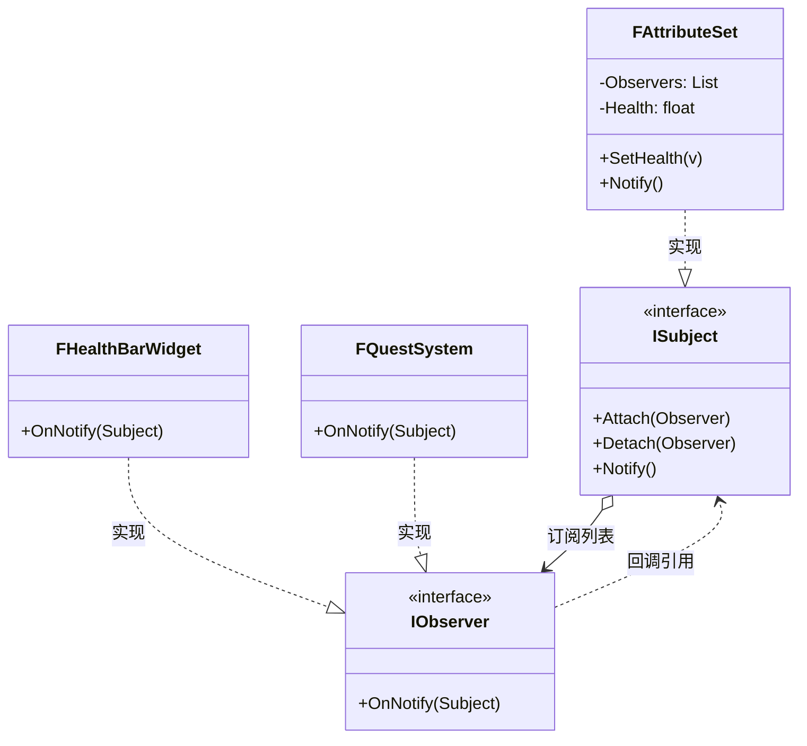

# 观察者

## Observer

# 观察者模式（Observer）深度透析

观察者解决的核心问题是：**一对多依赖，主题状态变化时自动通知所有订阅者**。

------

## 1. 意图与本质

GoF 定义：定义对象间的一种一对多的依赖关系，当一个对象的状态发生改变时，所有依赖于它的对象都得到通知并被自动更新。

用一句话说：

> **发布-订阅，状态变了自动广播**

### 核心作用（简要）

1. **解耦 Subject 与 Observer**：属性变不必手动调 UI
2. **动态订阅/退订**：Bind / Unbind
3. **事件驱动架构**：GAS、UI、任务系统

------

## 2. 结构拆解

### UML 类图（标准关系）



| 角色 | 职责 |
| :--- | :--- |
| Subject | 维护 Observer 列表，状态变时 Notify |
| Observer | 更新接口 `Update/OnNotify` |
| ConcreteSubject | 存储状态，Set 后 Notify |
| ConcreteObserver | 响应变化（刷新 UI 等） |

------

## 3. 关键机制

```cpp
class IHealthObserver {
public:
    virtual ~IHealthObserver() = default;
    virtual void OnHealthChanged(float NewHealth) = 0;
};

class FHealthSubject {
    TArray<IHealthObserver*> Observers;
    float Health = 100.f;
public:
    void Attach(IHealthObserver* O) { Observers.Add(O); }
    void SetHealth(float V) {
        Health = V;
        for (auto* O : Observers) O->OnHealthChanged(Health);
    }
};
```

UE Delegate 写法：

```cpp
DECLARE_MULTICAST_DELEGATE_OneParam(FOnHealthChanged, float);
FOnHealthChanged OnHealthChanged;
// Broadcast
OnHealthChanged.Broadcast(NewHealth);
```

------

## 4. 游戏开发场景

- **GAS Attribute → UI 血条**
- **任务/成就**：击杀事件广播
- **Damage 飘字**：Combat 事件通知 UI
- **Aura WidgetController**：BindCallbacksToDependencies

------

## 5. 与相关模式边界

| 对比 | 观察者 | 区别 |
| :--- | :--- | :--- |
| **中介者** | 多向协调 | 观察者**Subject 广播**，Observer 被动收 |
| **责任链** | 链式处理 | 观察者**全部通知** |
| **MVC** | View 观察 Model | MVC 是架构，Observer 是机制 |

------

## 6. 优点与代价

**优点**：松耦合、支持广播、动态订阅。  
**代价**：通知顺序不确定、循环依赖、调试栈深、需注意 Unbind 防悬空。

------

## 7. UE 对应

`DECLARE_DYNAMIC_MULTICAST_DELEGATE`、`UAbilitySystemComponent` 属性变化、`AddUObject` 绑定。

------

## 11. 小结

一句话：**数据变了，所有订阅者自动收到通知。**
