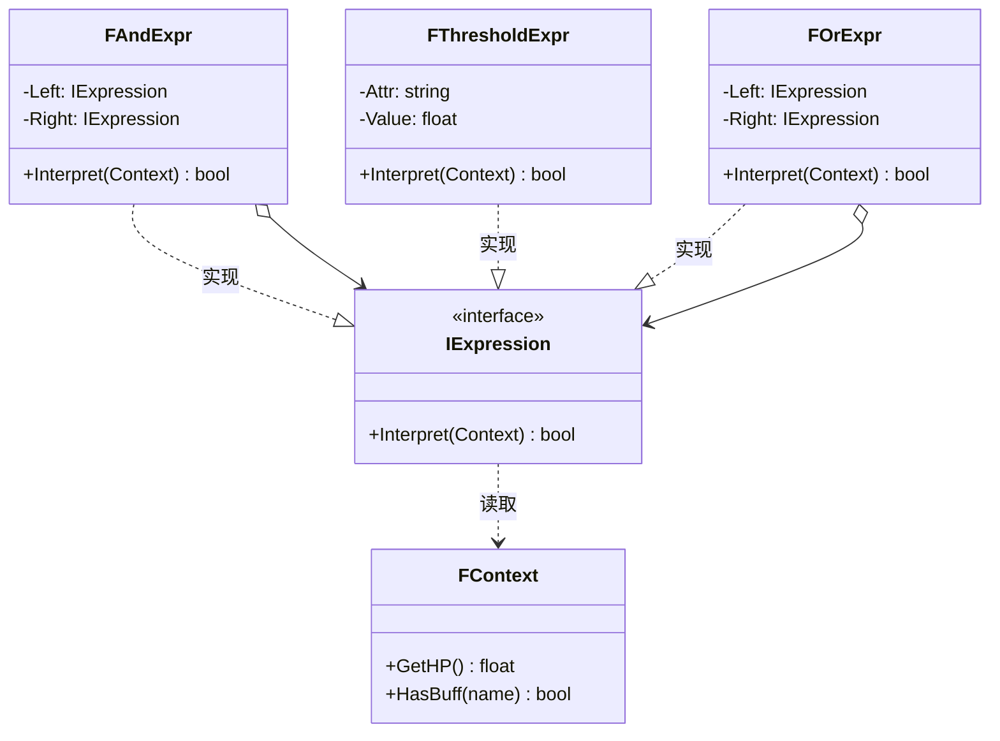

# 解释器

## Interpreter

# 解释器模式（Interpreter）深度透析

解释器解决的核心问题是：**为某种语言/表达式定义文法，并解释执行**，适合简单、可复用的规则 DSL。

------

## 1. 意图与本质

GoF 定义：给定一个语言，定义它的文法的一种表示，并定义一个解释器，使用该表示来解释语言中的句子。

用一句话说：

> **把规则变成语法树，再解释执行**

### 核心作用（简要）

1. **规则可配置**：不用硬编码 if-else
2. **文法结构清晰**：表达式树
3. **易扩展语法节点**：加新节点类型

------

## 2. 结构拆解

### UML 类图（标准关系）



| 角色 | 职责 |
| :--- | :--- |
| AbstractExpression | 声明 Interpret |
| TerminalExpression | 叶子规则（HP < 30） |
| NonterminalExpression | 组合（And / Or） |
| Context | 解释所需环境数据 |

------

## 3. 关键机制

```cpp
class FContext {
public:
    float HP = 0.f;
    TSet<FName> Buffs;
};

class IExpression {
public:
    virtual ~IExpression() = default;
    virtual bool Interpret(const FContext& Ctx) const = 0;
};

class FThresholdExpr : public IExpression {
    float Threshold;
public:
    explicit FThresholdExpr(float T) : Threshold(T) {}
    bool Interpret(const FContext& Ctx) const override {
        return Ctx.HP < Threshold;
    }
};

class FAndExpr : public IExpression {
    TUniquePtr<IExpression> L, R;
public:
    FAndExpr(TUniquePtr<IExpression> A, TUniquePtr<IExpression> B)
        : L(MoveTemp(A)), R(MoveTemp(B)) {}
    bool Interpret(const FContext& Ctx) const override {
        return L->Interpret(Ctx) && R->Interpret(Ctx);
    }
};

// HP < 30 AND HasBuff(Rage)
auto Rule = MakeUnique<FAndExpr>(
    MakeUnique<FThresholdExpr>(30.f),
    MakeUnique<FHasBuffExpr>("Rage")
);
bool CanExecute = Rule->Interpret(Context);
```

------

## 4. 游戏开发场景

- **技能释放条件**：`HP < 30 AND InRange AND HasMana`
- **任务触发条件**：区域 + 物品 + 对话状态
- **AI 简单决策规则**：可配置 DSL
- **关卡脚本**：简单逻辑表达式

> 复杂脚本更常用 Lua/Blueprint/DataTable，解释器适合**简单、高频、结构固定**的规则。

------

## 5. 与相关模式边界

| 对比 | 解释器 | 区别 |
| :--- | :--- | :--- |
| **组合** | 也是树结构 | 解释器树节点用于**求值/解释** |
| **访问者** | 遍历执行 | Visitor 把操作外置；解释器操作在节点内 |
| **策略** | 单一算法替换 | 解释器是**文法组合** |

------

## 6. 优点与代价

**优点**：规则清晰、易扩展节点、可配置。  
**代价**：复杂文法难维护、性能一般、易与组合模式混成复杂树。

------

## 7. UE 对应

GameplayTag 条件、Blueprint 表达式节点、GAS `UGameplayEffect` 条件、Simple Condition DataAsset。

------

## 11. 小结

一句话：**简单规则语言 → 语法树 → Interpret() 求值。**
