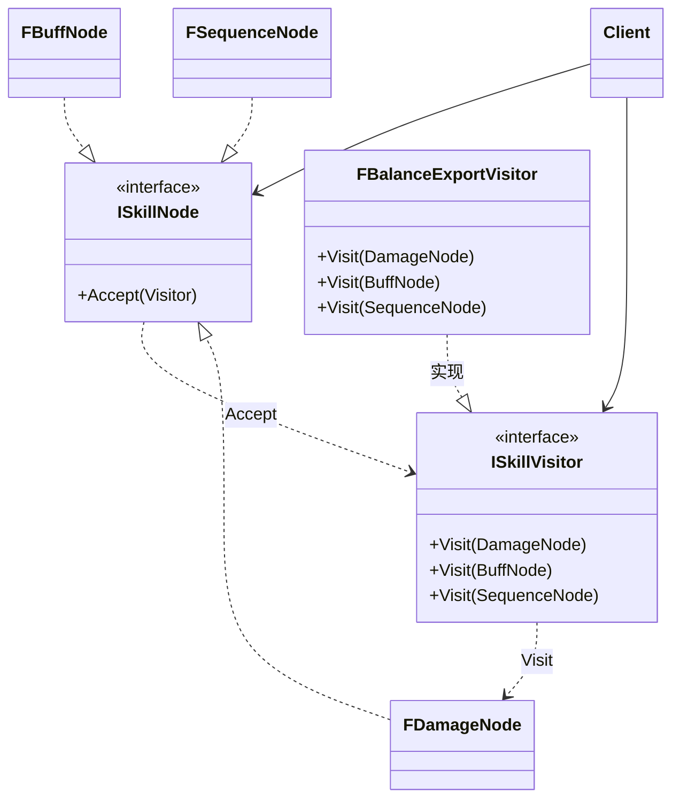

# 访问者

## Visitor

# 访问者模式（Visitor）深度透析

访问者解决的核心问题是：**在不修改元素类的前提下，为元素族添加新操作**（导出、分析、生成 UI）。

------

## 1. 意图与本质

GoF 定义：表示一个作用于某对象结构中的各元素的操作。它使你可以在不改变各元素的类的前提下定义作用于这些元素的新操作。

用一句话说：

> **操作外置，遍历元素时 dispatch 到 Visitor**

### 核心作用（简要）

1. **双分派**：`Accept(Visitor)` + `Visit(ConcreteElement)`
2. **新增操作不改 Element**：加 ExportVisitor 不改节点类
3. **批量处理异构节点**：技能树、AST、场景节点

------

## 2. 结构拆解

### UML 类图（标准关系）



| 角色 | 职责 |
| :--- | :--- |
| Visitor | 为每种 ConcreteElement 声明 Visit |
| ConcreteVisitor | 实现具体操作 |
| Element | 声明 Accept(Visitor) |
| ConcreteElement | Accept 中调用 `Visitor.Visit(this)` |
| ObjectStructure | 元素集合，供 Client 遍历 |

------

## 3. 关键机制（双分派）

```cpp
class FBalanceExportVisitor;

class ISkillNode {
public:
    virtual ~ISkillNode() = default;
    virtual void Accept(FBalanceExportVisitor& V) = 0;
};

class FDamageNode : public ISkillNode {
public:
    float Damage = 10.f;
    void Accept(FBalanceExportVisitor& V) override { V.Visit(*this); }
};

class FBalanceExportVisitor {
public:
    void Visit(const FDamageNode& N) { /* 导出伤害 */ }
    void Visit(const FBuffNode& N)    { /* 导出 Buff */ }
    void Visit(const FSequenceNode& N) {
        for (auto& Child : N.Children) Child->Accept(*this);
    }
};

// 使用
FBalanceExportVisitor Visitor;
Root->Accept(Visitor);
```

------

## 4. 游戏开发场景

- **技能树导出 JSON / 平衡性分析**
- **场景遍历**：收集灯光、碰撞体统计
- **编译器 AST**：Codegen Visitor
- **UI 生成**：从数据模型 Visitor 生成 Widget

------

## 5. 与相关模式边界

| 对比 | 访问者 | 区别 |
| :--- | :--- | :--- |
| **迭代器** | 只负责遍历 | Visitor 在遍历时**执行操作** |
| **解释器** | 操作在节点 Interpret 内 | Visitor **操作外置** |
| **组合** | 树结构 | 常对 Composite 树做 Visitor 遍历 |

**代价**：新增 Element 类型要改**所有** Visitor。

------

## 6. 优点与代价

**优点**：易加新操作、操作集中、适合稳定元素集。  
**代价**：新增元素类麻烦、破坏封装（Visitor 需访问 Element 内部）、依赖双分派。

------

## 7. UE 对应

`FPropertyVisitor`、Editor 资产扫描、Blueprint 编译遍历、自定义 Asset Export。

------

## 11. 小结

一句话：**元素类稳定、操作常新增时，用 Visitor 外置操作逻辑。**
