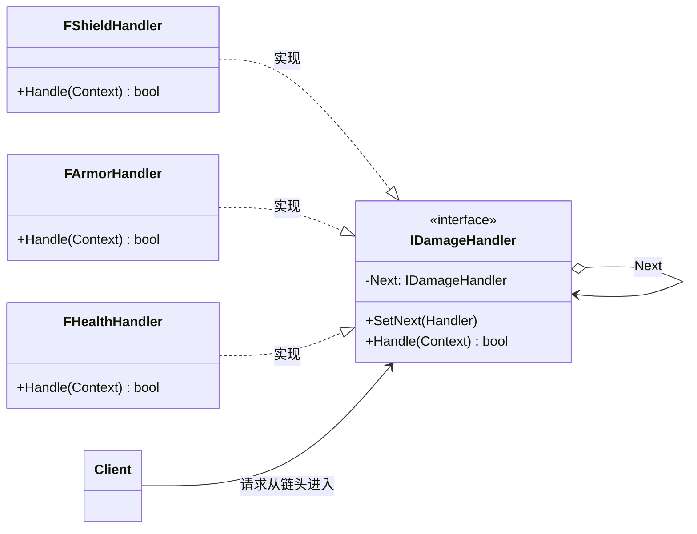

# 责任链

## Chain of Responsibility

# 责任链模式（Chain of Responsibility）深度透析

责任链解决的核心问题是：**让多个处理者依次有机会处理请求，解耦发送者与接收者**，直到有人处理或链结束。

------

## 1. 意图与本质

GoF 定义：使多个对象都有机会处理请求，从而避免请求的发送者和接收者之间的耦合关系。将这些对象连成一条链，并沿这条链传递请求，直到有一个对象处理它为止。

用一句话说：

> **请求沿链传递，谁合适谁处理**

### 核心作用（简要）

1. **解耦发送者与处理者**：Client 不知道谁最终处理
2. **动态组织处理顺序**：Shield → Armor → Health
3. **灵活增删处理节点**：加新 Handler 不改 Client

------

## 2. 结构拆解

### UML 类图（标准关系）



| 角色 | 职责 |
| :--- | :--- |
| Handler | 定义处理接口，持有 Next |
| ConcreteHandler | 能处理则处理，否则传给 Next |
| Client | 向链头提交请求 |
| Request / Context | 传递的数据（伤害上下文等） |

------

## 3. 关键机制

```cpp
struct FDamageContext {
    float Amount;
    EDamageType Type;
};

class IDamageHandler {
protected:
    IDamageHandler* Next = nullptr;
public:
    virtual ~IDamageHandler() = default;
    void SetNext(IDamageHandler* In) { Next = In; }

    void Handle(FDamageContext& Ctx) {
        if (!TryHandle(Ctx) && Next) Next->Handle(Ctx);
    }
protected:
    virtual bool TryHandle(FDamageContext& Ctx) = 0; // true=已处理/终止
};

class FShieldHandler : public IDamageHandler {
    bool TryHandle(FDamageContext& Ctx) override {
        if (Ctx.Type != EDamageType::Magic) return false;
        Ctx.Amount *= 0.5f;
        return false; // 继续传递（减伤但不终止）
    }
};
```

------

## 4. 游戏开发场景

- **伤害结算**：护盾 → 护甲 → 减伤 Buff → 扣血
- **输入事件**：UI → 菜单 → 玩家 → 默认
- **审批/过滤**：聊天敏感词、权限校验链
- **AI 感知**：视觉 → 听觉 → 默认 Idle

------

## 5. 与相关模式边界

| 对比 | 责任链 | 区别 |
| :--- | :--- | :--- |
| **装饰器** | 每层都执行 | 责任链**可能只一个处理**或部分处理后传递 |
| **组合** | 树形统一操作 | 责任链是**线性传递** |
| **中介者** | 中心化路由 | 责任链是**链式**去中心化 |

------

## 6. 优点与代价

**优点**：解耦、易扩展 Handler、可动态调整链。  
**代价**：不保证被处理、调试链路长、顺序敏感。

------

## 7. UE 对应

GameplayAbility 伤害管线、Enhanced Input 优先级、Slate 事件路由。

------

## 11. 小结

一句话：**请求沿处理链传递，直到被处理或耗尽。**
