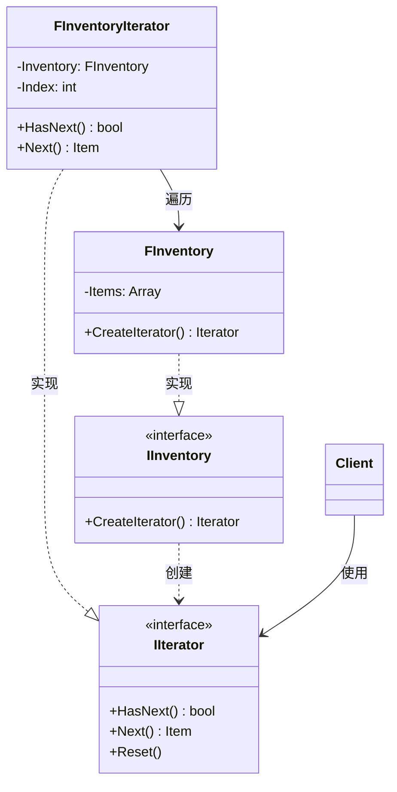

# 迭代器

## Iterator

# 迭代器模式（Iterator）深度透析

迭代器解决的核心问题是：**提供一种方法顺序访问聚合对象中的元素，而不暴露其内部表示**。

------

## 1. 意图与本质

GoF 定义：提供一种方法顺序访问一个聚合对象中各个元素，而又不暴露该对象的内部表示。

用一句话说：

> **统一遍历方式，隐藏容器内部结构**

### 核心作用（简要）

1. **统一遍历接口**：`Begin()` / `End()` / `++`
2. **隐藏实现**：数组、链表、哈希、ECS 各自封装
3. **多种遍历策略**：过滤迭代、反向迭代

------

## 2. 结构拆解

### UML 类图（标准关系）



| 角色 | 职责 |
| :--- | :--- |
| Iterator | 定义遍历接口 |
| ConcreteIterator | 跟踪当前位置 |
| Aggregate | 创建 Iterator |
| ConcreteAggregate | 持有集合并返回 Iterator |

------

## 3. 关键机制

```cpp
class IItemIterator {
public:
    virtual ~IItemIterator() = default;
    virtual bool HasNext() const = 0;
    virtual FItem& Next() = 0;
};

class FInventoryIterator : public IItemIterator {
    const TArray<FItem>& Items;
    int Index = 0;
public:
    explicit FInventoryIterator(const TArray<FItem>& In) : Items(In) {}
    bool HasNext() const override { return Index < Items.Num(); }
    FItem& Next() override { return Items[Index++]; }
};

// 现代 C++ 更常见：range-for + 标准迭代器
for (FItem& Item : Inventory) { Use(Item); }
```

------

## 4. 游戏开发场景

- **背包 / 仓库遍历**
- **ECS Entity 视图**：`for (auto& E : View<Transform, Health>)`
- **空间哈希桶**、**开放世界 Region** 遍历
- **UI 列表**子项遍历

------

## 5. 与相关模式边界

| 对比 | 迭代器 | 区别 |
| :--- | :--- | :--- |
| **访问者** | 遍历 + 对每个元素执行操作 | Iterator 只负责**访问顺序** |
| **组合** | 树形结构 | 组合常配合 Iterator 做深度/广度遍历 |
| **C++ 标准库** | `begin/end` 已是 Iterator | 模式中强调**封装 Aggregate** |

------

## 6. 优点与代价

**优点**：解耦遍历与容器、可多种迭代器、符合单一职责。  
**代价**：现代语言内置支持后模式感减弱；并发修改容器需小心。

------

## 7. UE 对应

`TMap::CreateIterator`、`FActorIterator`、`TFieldIterator`、Range-based for on `TArray`。

------

## 11. 小结

一句话：**不管底层是数组还是哈希，用统一方式逐个访问元素。**
